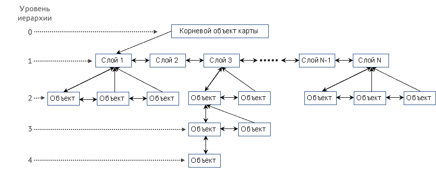

# Основные понятия

## Цифровая карта

Под ЦИФРОВОЙ КАРТОЙ (далее – картой) в данном документе понимаются цифровые данные в векторном формате о пространственных объектах участка местности, расположенных в границах карты. Вся информация цифровой карты содержится в файле внутреннего формата с расширением &#42;.DM.

## Типы цифровых карт

ПК «ГИС Нева» поддерживает работу с двумя типами цифровых карт:
1. **«Карта»** – набор объектов, привязанный к географическим координатам земной поверхности с использованием устанавливаемых при создании карты геодезической системы координат и картографической проекции.
**«Номенклатурный лист»** – разновидность типа «Карта» для определённых стандартных видов разграфки карт, когда система координат, проекция и рамка карты автоматически определяются по имени номенклатурного листа разграфки.
1. **«План»** – набор объектов в произвольной прямоугольной системе координат без привязки к географическим координатам земной поверхности, т.е. для плана не устанавливается система координат и проекция.

## Структурная модель карты

Вся информация карты организована в виде набора однотипных структурных элементов, связанных в единое иерархическое дерево.
Каждый структурный элемент карты (объект) может содержать следующую информацию:
+ класс объекта;
+ тип объекта;
+ координатное описание;
+ атрибутивное описание.

Обязательным является наличие описания класса объекта (классификационный код) и его типа. Координатное и атрибутивное описания необязательны.

### Иерархическое дерево карты

представлено на рисунке 1.

Иерархическое дерево цифровой карты

Таблица 1 – Описание файлов Классификатора
