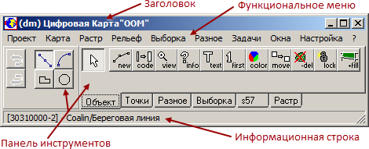

# Основное меню головного программного модуля

Основное меню открывается при запуске головного программного модуля и выглядит, как представлено на рисунке:

Основное меню головного программного модуля

Основное меню состоит из четырёх составных элементов:
+ Заголовок
+ Функциональное меню
+ Панель инструментов работы с объектами
+ Информационная строка