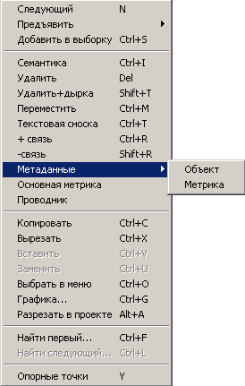

# Описание метаданных

При работе с информацией цифровой карты обеспечивается возможность формирования метаданных, т.е. данных, описывающих общие свойства и характеристики цифровой карты (например, системы координат, проекции, масштаба, актуальности информации, используемого классификатора и исходных материалов, по которым создана карта и т.п.), а также её составных элементов (объектов, атрибутов, координатных описаний). В зависимости от уровня описываемой информации метаданные подразделяются на уровни по старшинству:
+ Метаданные цифровой карты
+ Метаданные объекта
+ Метаданные атрибута
+ Метаданные координатного описания

Метаданные описываются значениями атрибутов (характеристик). Часть атрибутов уровня цифровой карты, входящих в понятие «Паспорт карты», используется программой по умолчанию и не требует предварительных настроек. Заполнение значениями выполняется или автоматически при создании карты или вручную через окно «Паспорт карты». Описание необходимых пользователю дополнительных уровней и атрибутов метаданных выполняется в Редакторе Классификатора или в составе текущего Классификатора карты в виде специальным образом оформленных бланков для атрибутов метаданных различных уровней.

Один и тот же атрибут может использоваться для описания метаданных на различном уровне, например, актуальность информации может быть описана как для всей карты, так и для отдельного объекта. При этом указанная актуальность для объекта «перебивает» установленную актуальность для карты. Т.е. атрибуты метаданных младшего уровня «сильнее» этих же атрибутов, установленных на старшем уровне. 
Заполнение бланка метаданных для объекта или координатного описания (метрики) выполняется через меню, выпадающее по щелчку правой клавиши мыши для активного объекта или объекта-координатного описания как представлено на рисунке:

Меню вызова бланков для заполнения метаданных объекта и координатного описания

Вызов бланка метаданных для атрибутов выполняется в режиме редактирования атрибутов (семантики) непосредственно в бланке атрибутов объекта, как показано на рисунке:

Меню вызова бланка заполнения метаданных для конкретного атрибута объекта

Хранение метаданных в цифровой карте осуществляется в виде специальных комплексных атрибутов с номерами:
+ #32000 – метаданные объекта;
+ #32001 – метаданные координатного описания;
+ #33NNN – метаданные атрибута с номером NNN.