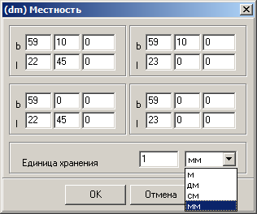

# Привязка карты к местности

Координатное описание объектов карты во внутреннем файле DM-формата хранится в локальной прямоугольной целочисленной системе координат. Значения локальных координат в виде длинных целых чисел (пикселов) выбраны в целях обеспечения высокой скорости отображения информации карты в окне Редактора.

При создании цифровой карты обязательно устанавливается значение «Единицы хранения» земных координат в одном пикселе локальной системы координат, т.е. какое расстояние на местности соответствует одному пикселю карты. Значение единицы хранения устанавливается из списка возможных значений:
+ 1 метр
+ 1 дециметр
+ 1 сантиметр
+ 1 миллиметр

Значение единицы хранения может быть изменено для ранее созданных карт. При этом следует учитывать, что изменение в сторону увеличения значения (например, с 1&nbsp;дециметра на 1&nbsp;метр) приведёт к понижению точности координатного описания объектов.

Для обеспечения пересчёта координат из локальной системы в геодезическую, в карте всегда хранятся специальные точечные объекты – привязочные точки, располагаемые, как правило, по углам карты или участка местности, который она охватывает. Для номенклатурных листов топографических карт создаётся ещё одна точка в центре карты.

Точки привязки являются специальными точечными объектами с кодом 00000000 и размещаются автоматически при создании карты в её первом слое. Местоположение угловых точек определяет их координаты в локальной системе координат (метрика), а семантика содержит координаты этих точек в местной (геодезической) системе координат. Если цифровая карта типа «План», то прямоугольные координаты местности записаны в характеристиках 901 (X-координата) и 902 (Y- координата). Если цифровая карта типа Карта, то значение широты (B) хранится в 91-й характеристике, а значение долготы (L) в 92-й характеристике угловой точки. Удалить служебные объекты-угловые точки из карты невозможно. На рисунке приведено изображение одного из окон паспорта карты, где отображаются значения геодезических координат угловых точек карты и устанавливается единица хранения:

Рамка карты является линейным объектом, проходящим через угловые привязочные точки. Данный объект хранится в виде метрики корневого объекта карты и отображается в виде замкнутой чёрной линии.

Для карт типа «План» рамка представляет собой четырёхугольник с углами, заданными при создании карты. Для номенклатурных листов карт рамка является трапецией. Углы четырёхугольника или трапеции совпадают с угловыми точками привязки. Рамка карты может содержать произвольное количество точек метрики. Например, для номенклатурных листов топографических карт масштаба 1:200&nbsp;000 и мельче программа автоматически добавляет необходимые точки прогиба в нижнюю и верхнюю стороны рамки.