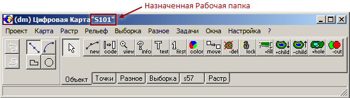
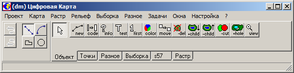

# Общая информация

## Назначение

Программный комплекс «ГИС Нева» (ПК «ГИС Нева») предназначен для создания, обновления и обработки информации цифровых векторных карт, а также решения информационно-расчётных задач, разрабатываемых в виде отдельных программных приложений к ПК «ГИС Нева».

Обязательным условием работы с цифровой картой является предварительное описание её информационной модели в виде Классификатора, содержащего описание:
+ классов объектов;
+ атрибутов;
+ возможных отношений (связей) между классами объектов;
+ условных знаков для отображения.

Создание и редактирование Классификатора осуществляется с использованием специальных программных средств, входящих в состав ПК «ГИС Нева».

## Аппаратные и системные требования

Для работы программного комплекса рекомендуется использовать персональные компьютеры с характеристиками не хуже, чем: 
+ процессор – Intel Core i3 1.7 ГГц;
+ оперативная память – 4Гб; 
+ жесткий диск емкостью – 500 Гб; 
+ графическая карта – типа SVGA 1 Гб;
+ манипулятор типа «мышь»;
+ монитор (рекомендуется размер экрана 17").

Каждая рабочая станция должна быть снабжена источником бесперебойного питания.
В качестве операционной системы для рабочих станций рекомендуется Windows 7 или её более поздние версии. 

## Состав

Минимально необходимым для выполнения работ с помощью ПК «ГИС Нева» является наличие на рабочей станции:
+ базовых программных средств;
+ Классификатора цифровой карты.
	
### Базовые программные средства

В состав базовых программных средств ПК «ГИС Нева» входят:
+ головной программный модуль – картографический редактор (DMW.EXE);
+ набор внутренних dll-библиотек головного программного модуля со служебными файлами;
+ редактор Классификатора (OBJ.EXE или OBJ2.EXE в зависимости от используемой модели Классификатора);
+ редактор Бланков (ID.EXE, ID2.EXE в зависимости от используемой модели Классификатора);
+ редактор Знаков (VGM.EXE).

Все программы выполнены в виде отдельных исполняемых модулей и могут работать независимо друг от друга. Обмен информацией между модулями осуществляется через совместно используемые файлы. При необходимости, модули, работающие с классификатором,  могут быть вызваны командами функционального меню из картографического редактора.

В данном разделе документации содержится руководство пользователя для работы с головным программным модулем – картографическим редактором. Руководства пользователя для программных средств ведения Классификатора (OBJ.EXE, ID.EXE, VGM.EXE) представлены в отдельных документах.

### Классификатор цифровой карты

Цифровая карта является набором структурных классифицированных единиц – объектов, описание которых выполняется в соответствии определённой информационной моделью. Под информационной моделью понимается описание классов объектов, атрибутов для описания свойств объектов и отношений между классами объектов. Модель также, как правило, содержит описание ограничений на значения атрибутов и отношений между объектами, которые проверяются при создании объектов или связей между ними. Если при проверке выявляется нарушение ограничений, то пользователю выдаётся предупреждение о невозможности выполняемого им действия.
 
В среде ПК «ГИС Нева» информационная модель представляется Классификатором, который создаётся с помощью программы «Редактор Классификатора».

Помимо описания модели информации Классификатор также содержит описание графических параметров условных знаков для отображения объектов на экране.

При создании для Классификатора выбирается одна из моделей – картографическая или объектная.

##### Картографическая модель
Картографическая модель предполагает, что описание классов объектов ориентировано на создание цифровых карт, используемых, в первую очередь, в качестве картографического изображения фиксированного масштаба. Состав, классификация объектов и правила цифрового описания объектов соответствует какой-либо системе условных знаков и определённому масштабу традиционных карт.

В составе объектов цифровой карты картографической модели обязательно присутствуют специальные непространственные картографические объекты – «подписи» и «условные знаки», предназначенные для отображения информации о свойствах объектов.

##### Объектная модель

Объектная модель описания информации о местности предполагает унифицированный подход к понятию пространственного объекта и системе классификации информации, не привязанной к какой-либо системе условных знаков традиционных карт. Она ориентирована на создание цифровых наборов пространственных объектов для информационно-расчётных задач и создания мультимасштабных динамически отображаемых картографических изображений (растровых кэшей) из одного набора данных цифровой карты.

Классификация объектов не привязана к картографическим системам условных знаков, а базируется на учёте базовых (не изменяющихся во времени) свойств пространственных объектов.
В дополнение к картографической модели объектная модель имеет следующие информационные возможности для цифровой карты:
+ фиксация в виде связей различного рода отношений между объектами;
+ создание объектов без координатного описания;
+ формирование для одного объекта нескольких координатных описаний различных типов;
+ формирование атрибутов, имеющих координатную привязку к объекту (координированные атрибуты);
+ создание комплексных (составных) атрибутов;
+ создание специальных информационных объектов.

 Как правило, цифровая карта в объектной модели не содержит объектов типа «подпись» и «условный знак».
 
##### Структура и содержание Классификатора

Классификатор является описанием информационной модели объектов цифровой карты и содержит описание классов объектов, атрибутов, возможных отношений (связей) между классами объектов, а также условных знаков для отображения. Для создания Классификатора используется соответствующая программа «Редактор Классификатора», существующая в двух вариантах: для создания Классификаторов только картографической модели программа «OBJ.EXE», и для создания Классификаторов в объектной модели – «OBJ2.EXE».

Классификатор объектной модели поддерживает все возможности картографической, но Классификатор картографической модели не поддерживает специальные возможности объектной модели. Возможно преобразование Классификатора из картографической в объектную модель, для чего достаточно открыть его в Редакторе Классификатора объектной модели (OBJ2.EXE) и сохранить. После этого он не может редактироваться в Редакторе Классификатора картографической модели (OBJ.EXE).

Классификатор представляет собой набор файлов, объединенных общим именем, и имеющих различные расширения. Имена файлов являются именем Классификатора, а расширение имени определяет специфику составной части информации Классификатора. В представленной ниже таблице содержится описание файлов Классификатора, хранящейся в нём информации и его обязательности в составе Классификатора.

Таблица – Описание файлов Классификатора
| №<br>п\п | Расширение<br>имени файла | Описание файла Классификатора                                                                                                                                                                                                                                            | Обязательность                                                                                           |
|-------|------------------------|--------------------------------------------------------------------------------------------------------------------------------------------------------------------------------------------------------------------------------------------------------------------------|----------------------------------------------------------------------------------------------------------|
| 1     | obj                    | Головной файл Классификатора, осуществляющий связь всех остальных файлов Классификатора между собой.                                                                                                                                                                     | Обязателен                                                                                               |
| 2     | idx                    | Содержит перечень классов объектов, их наименования, классификационные коды, типы и упрощённые параметры                                                                                                                                                                 | Обязателен, если для объектов допускается атрибутивное описание                                          |
| 3     | bln                    | условных знаков для линий и областей.                                                                                                                                                                                                                                    | Обязателен, если для объектов допускается атрибутивное описание                                          |
| 4     | mdb                    | Общий пронумерованный перечень атрибутов (характеристик), доступных для использования объектами. Содержит описание наименований характеристик и их типов.                                                                                                                | Обязателен, если для объектов есть характеристики перечислимого типа, и они не описаны в виде dbf-таблиц |
| 5     | mnu                    | Описание блоков (бланков) атрибутов, которые могут быть назначены для объектов Классификатора. Один бланк может быть назначен для использования несколькими объектами.                                                                                                   | Не обязателен                                                                                            |
| 6     | vgm                    | База данных, содержащая таблицы значений атрибутов перечислимого типа. Имя таблицы соответствует номеру характеристики. Альтернативным вариантом является представления этих таблиц в виде набора файлов dbf-формата, где имя файла соответствует номеру характеристики. | Обязателен при наличии в Классификаторе внемасштабных объектов                                           |
| 7     | pgm                    | Упорядоченный пользователем иерархический набор пиктограмм объектов, используемый картографическим редактором для выбора класса объекта при выполнении различных операций.                                                                                               | Не обязателен                                                                                            |
| 8     | pat                    | Библиотека векторных внемасштабных условных знаков для отображения объектов, пространственное положение которых описывается координатами одной точки, при этом допускается использование второй точки, которая указывает вектор поворота знака.                          | Не обязателен                                                                                            |
| 9     | ext                    | Библиотека растровых внемасштабных условных знаков для отображения объектов, пространственное положение которых описывается координатами одной точки.                                                                                                                    | Не обязателен                                                                                            |
| 10    | idc                    | Дополнительные параметры условных знаков объектов в зависимости от значений их атрибутов (условная графика объектов)                                                                                                                                                     | Не обязателен                                                                                            |
| 11    | rgb                    | Описание настроенной цветовой палитры для данного Классификатора                                                                                                                                                                                                         | Не обязателен                                                                                            |
| 12    | rol                    | Описание отношений (связей) между классами объектов и их ограничений                                                                                                                                                                                                     | Не обязателен                                                                                            |
| 13    | atr                    | Описание параметров графики и условий для отображения значений атрибутов объектов в виде динамически размещаемых на экране надписей или условных знаков. Объекты типа «подпись» в цифровой карте при этом, как правило, не создаются                                     | Не обязателен                                                                                            |
| 14    | attr2                  | Описание параметров динамического отображения значений атрибутов в виде окружностей и секторов (для условных знаков круговых и секторных огней в навигационных морских картах)                                                                                           | Не обязателен                                                                                            |
| 15    | ft1                    | Вспомогательный текстовый файл описания шаблонов для автоматической генерации в цифровой карте объектов типа «подпись» или их обновления на основании значений атрибутов пространственных объектов                                                                       | Не обязателен                                                                                            |
| 16    | grp                    | Вспомогательный текстовый файл, содержащий описание группировки объектов классификатора в легенде                                                                                                                                                                        | Не обязателен                                                                                            |
| 17    | alt                    | Специальный файл описания комбинаций объектов. Комбинации создаются в Редакторе Классификатора и используются для создания группы объектов за одну операцию векторизации (сочетания растительности)                                                                      | Не обязателен                                                                                            |
| 18    | xt                     | Вспомогательный текстовый файл описания правил заполнения атрибутов объектов по значениям атрибутов связанных с ними других объектов. Используется процедурой «info attribute» библиотеки dll_dm2                                                                        | Не обязателен                                                                                            |
| 19    | buf                    | Вспомогательный текстовый файл описания правил автоматического создания информационных объектов и заполнения их атрибутов по содержимому системного буфера обмена (clipboard)                                                                                            | Не обязателен                                                                                            |

Если в Классификаторе цифровой карты описаны текстовые объекты (тип «подпись») или используется режим отображаемых атрибутов, т.е. отображения значений атрибутов объектов в виде подписей на экране, то необходимо наличие служебных файлов шрифтов с расширением *.VGT на каждый используемый шрифт. Шрифты размещаются в отдельной папке (правила размещения см. ниже)

## Правила размещения на компьютере {#anchor1}

### Основная папка

Все программные компоненты ПК «ГИС Нева» размещаются в одном каталоге (папке) с произвольным именем, в котором запрещено использовать пробелы и специальные символы (точка, запятая и т.п.).

Путь к папке размещения ПК «ГИС Нева» не должен быть слишком длинным и также не может содержать пробелов и спецсимволов.

Данная папка для ПК «ГИС Нева» получила название «Основная папка» (ОП).

### Рабочая папка

Для каждого вида технологии работы с определённым видом цифровой карты используются свои файлы Классификатора, а также различные вспомогательные технологические файлы. При выполнении на одном компьютере нескольких видов технологий обработки различных карт удобно и целесообразно фиксировать весь требуемый набор технологических файлов в отдельных каталогах для каждого вида карт и технологии.

Такой каталог назначается в поле «Проект» меню головного программного модуля и получил название «Рабочая папка» (РП).

Назначенная РП сохраняется головным модулем при его закрытии и при повторном запуске восстанавливается, имя рабочей папки пишется в заголовке головного программного модуля, как представлено на рисунке.



### Размещение программных и технологических файлов

Размещение программных и технологических файлов выполняется в Основной и Рабочих папках. По умолчанию Основная папка ПК «ГИС Нева» является и Рабочей папкой. Для размещения программных и технологических файлов внутри Основной и Рабочей папки создаются подкаталоги с зарезервированными именами. В представленной ниже таблице описаны зарезервированные имена папок (подкаталогов ОП или РП) и размещаемые в них компоненты, а также указана обязательность наличия каталога и её возможность размещения в Рабочей папке.

Таблица – Состав каталогов Основной и Рабочих папок ПК «ГИС Нева»
| Имя<br>каталога | Обязательность<br>наличия | Возможность<br>размещения<br>в РП | Содержимое                                                                                                      | Особенности                                                                                                                                                                                                  |
|--------------|------------------------|-----------------------------|-----------------------------------------------------------------------------------------------------------------|--------------------------------------------------------------------------------------------------------------------------------------------------------------------------------------------------------------|
| BIN          | да                     | нет                         | Программные компоненты и их служебные файлы                                                                     | Создается только в Основной папке                                                                                                                                                                            |
| DB           | нет                    | да                          | Базы данных mdb-формата, содержащие дополнительное атрибутивное описание объектов карты                         | Связь объектов с таблицами баз данных осуществляется с помощью специальных атрибутов перечислимого типа - Dbase                                                                                              |
| DBF          | нет                    | да                          | DBF- файлы характеристик перечислимого типа                                                                     | Если разные классификаторы используют одни имена DBF-файлов, то вместо данного каталога (или вместе с ним) можно создать каталоги с именем классификаторов, куда разместить DBF-файлы данного классификатора |
| FILTER       | нет                    | да                          | Файлы настроенных фильтров отбора объектов в выборки                                                            | Связаны с файлами пакетов, размещаемых в папке pkg                                                                                                                                                           |
| FONTS        | нет                    | да                          | Файлы шрифтов для визуализации подписей                                                                         | Файлы шрифтов могут размещаться вместе с файлами классификаторов в каталоге obj                                                                                                                              |
| HLP          | нет                    | нет                         | Файлы справки по работе с программой                                                                            |                                                                                                                                                                                                              |
| INI          | нет                    | да                          | Файлы параметров выполнения программ из динамических библиотек и отдельных приложений                           |                                                                                                                                                                                                              |
| OBJ          | да                     | да                          | Файлы классификаторов                                                                                           |                                                                                                                                                                                                              |
| PKG          | нет                    | да                          | Технологические файлы – создаваемые пользователем программы для автоматической обработки цифровых карт (пакеты) |                                                                                                                                                                                                              |
| WORK         | да                     | да                          | Служебные файлы и файлы пользовательских настроек:                                                              |                                                                                                                                                                                                              |

Если указанные в таблице каталоги присутствуют одновременно в Основной и установленной Рабочей папке, то приоритет в использовании у каталогов, находящихся в Рабочей папке. Если в Рабочей папке отсутствует какая-либо технологическая папка, то используется её аналог из Основной папки.

Для хранения временных файлов (настройки опций, протоколы, настройки последних сеансов и др.) используется место на системном диске Windows в директории:
_«System_disc:\Users\Имя_пользователя\AppData\Roaming\dmw\»_

Рабочие файлы цифровых карт и растров могут размещаться в любом каталоге пользователя.

## Установка ПК и запуск головного программного модуля

Установка ПК «ГИС Нева» осуществляется путём копирования содержимого установочного диска в папку, созданную на локальном жёстком диске компьютера – см. [Правила размещения на компьютере](#anchor1).

Запуск головного программного модуля DMW.EXE выполняется по общим правилам OS Windows. В результате успешного запуска на экране отобразится основное меню головного программного модуля, представленное на рисунке.



Самый первый запуск на рабочей станции должен осуществляться от имени Администратора, т.к. при первом запуске программы осуществляется регистрация в системном реестре OS&nbsp;Windows. Вследствие этого рекомендуется избегать установки на одной рабочей станции нескольких версий программных компонентов (папка BIN). Если же это необходимо, то целесообразно при переходе на другую версию программ выполнить первый запуск необходимой версии от имени Администратора.

Для корректной работы внешних приложений, использующих ActiveX-компоненты, входящие в состав ПК «ГИС Нева», необходимо зарегистрировать эти компоненты. Для этого требуется запустить от имени администратора командный процессор cmd.exe, перейдите в BIN-директорию ПК «ГИС Нева» и запустить командный файл ocx.bat. Например, если ПК «ГИС Нева» установлен в папку d:\Neva, необходимо ввести в командную строку следующие команды:
```
>d:
>cd Neva\BIN
>ocx.bat
```