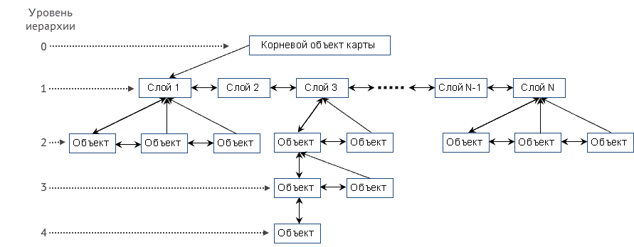
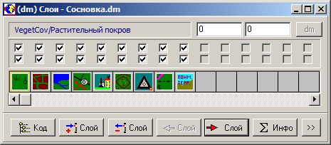
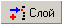
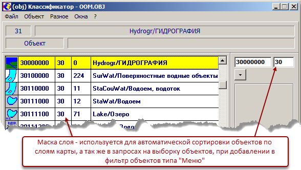
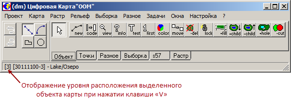
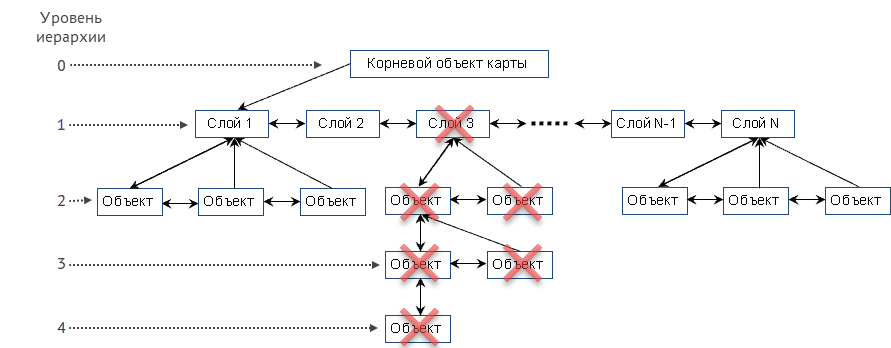

# Структурная модель карты

Вся информация карты организована в виде набора однотипных структурных элементов, связанных в единое иерархическое дерево.
Каждый структурный элемент карты (объект) может содержать следующую информацию:
+ класс объекта;
+ тип объекта;
+ координатное описание;
+ атрибутивное описание.

Обязательным является наличие описания класса объекта (классификационный код) и его типа. Координатное и атрибутивное описания необязательны.

## Иерархическое дерево карты {#anchor1}

На рисунке представлено иерархическое дерево цифровой карты, которое состоит из веток и организуется путём установления связей между структурными элементами – объектами. Связь представляет собой ссылку от одного объекта на другой. Ссылками связаны соседние объекты в одном уровне иерархии (в одной ветке). Это горизонтальные связи: «сосед слева» и «сосед справа».

Ссылкой «вниз» на нижний уровень от любого объекта на другой объект образуется его подчинённая ветка. Этот объект является «родительским» для всех объектов его ветки, объекты подчинённой ему ветки – «дочерние» объекты для «родительского». Дочерние объекты расположены на уровень ниже родительского.
 
Таким образом, каждый объект иерархического дерева, кроме корневого объекта, может содержать следующие ссылки (связи):
+ сосед слева;
+ сосед справа;
+ первый дочерний (подчинённый) объект (ссылка вниз);
+ родительский объект (ссылка наверх).

Для корневого объекта допустима только одна ссылка вниз – первый дочерний (подчиненный) объект.
Для просмотра объектов карты с возможностью перемещения по иерархическому дереву используется диалоговое окно «Инспектор», представленное на рисунке ниже.

Открыть данное диалоговое окно можно командой функционального меню «Окна»–«Инспектор» или горячей клавишей F5.

В инспекторе отображается вся информация по текущему объекту, а расположенные сверху кнопки стрелок (влево, вправо, вверх, вниз) позволяют перемещаться на другие объекты в дереве по соответствующей стрелке.

## Корневой объект и паспорт карты

В вершине иерархического дерева карты (см. рисунок [Иерархическое дерево цифровой карты](#anchor1) – уровень 0) расположен корневой объект карты, содержащий общее описание карты:
+ классификационный код корневого объекта – 00000000;
+ тип объекта – линия;
+ координатное описание – координаты точек границы (рамки) карты;
+ атрибутивное описание или Паспорт карты (метаданные) – набор характеристик, описывающих карту в целом (классификатор, проекция, система координат, масштаб, номенклатура и т.п.).

## Слои карты

Корневой объект карты ссылается вниз по дереву на первый структурный элемент уровня 1. На уровне 1 располагаются в упорядоченной последовательности специальные объекты, определяющие слои карты.

### Общее описание слоя

Слои карты обеспечивают разделение на группы (слои) всех объектов цифровой карты, т.е. каждый объект цифровой карты обязательно принадлежит одному из слоёв. 
Описание специального объекта «Слой карты»:
+ классификационный код – описывается в Классификаторе;
+ тип объекта – «Меню»;
+ координатное описание – отсутствует;
+ атрибутивное описание – отсутствует.

Количество слоёв в карте неограниченно. Слой может не содержать объектов карты, т.е. быть пустым.

### Создание слоёв и управление слоями карты

При создании новой карты программа всегда формирует один слой с кодом 00000000, в котором располагаются специальные объекты – угловые точки карты. При объединении информации карт (внешняя карта «вставляется» в текущую) их слои суммируются, т.е. если есть слои с совпадающими кодами, то объекты внешней карты размещаются в таком же слое текущей карты, а если в текущей карте нет слоя внешней карты, то он добавляется в текущую карту.
Для слоя могут быть выполнены операции: 
+ вкл/выкл видимость всех объектов слоя;
+ удалить слой со всеми объектами слоя;
+ запретить редактирование всех объектов слоя;
+ собрать статистическую информацию по объектам слоя;
+ переместить слой относительно других слоёв.

Для выполнения операций над слоями предназначено диалоговое окно «Слои», которое открывается командой функционального меню «Окна»–«Слои» или горячей клавишей F7.

В данном диалоговом окне отображаются пиктограммы слоев, которые размещены слева направо от первого слоя до последнего. Отображение объектов карты на экран выполняется в этой последовательности, т.е. изображение всех объектов следующего слоя накладывается на изображение объектов предыдущих слоев. Положение любого слоя в последовательности может быть интерактивно изменено.

В этом окне можно добавить, удалить, переместить слои, присвоить им код, собрать по ним информацию, назначить масштабы видимости слоя. Новые слои создаются на основе объектов типа «меню» из классификатора, т.е. для создания слоя необходимо открыть диалоговое окно «Легенда» (F6), в нём выбрать объект типа «Меню» и нажать кнопку «Добавить слой» .

При добавлении слоя ему будут назначены код, имя и пиктограмма, соответствующие этому объекту. Если окно Легенды не открыто или в нём не выбран объект типа «Меню», программа не сможет создать новый слой. При удалении слоя автоматически удаляются все объекты, принадлежащие этому слою, при этом программа выдаёт предупреждение и сообщает количество удаляемых объектов в слое.

## Объекты карты

Объект-слой ссылается вниз по иерархическому дереву на свой первый дочерний объект уровня 2 – это объект цифровой карты, расположенный в этом слое. На уровне 2 в каждом слое располагаются упорядоченно объекты карты данного слоя.

При создании объекта в карте он автоматически размещается в слой, назначенный ему в Классификаторе указанием в специальном поле маски слоя. Маска слоя состоит из двух первых символов классификационного кода объекта-слоя, в который необходимо поместить объект данного класса.

На рисунке изображен фрагмент Классификатора, где объекту с кодом 30111100 назначен слой размещения, классификационный код которого в первых двух позициях содержит значение «30».

При добавлении объекта в карту он заносится в слой, две старших цифры которого совпадают с установленным для объекта признаком в классификаторе (Маска слоя).

Если для добавляемого объекта в карте отсутствует соответствующий слой, то он добавляется в первый слой карты.

Каждый объект карты уровня 2 может «под собой» иметь дочерние объекты на уровне 3. Объекты уровня 3 – родительские для объектов уровня 4 и так далее (см. рисунок [Иерархическое дерево цифровой карты](#anchor1)).

Для ручного перемещения объекта между уровнями иерархического дерева внутри слоя используется специальная функция редактора.

Для выделенного в карте объекта можно увидеть значение уровня, на котором он расположен, с помощью нажатия на клавишу «V». Если объект расположен на уровне ниже второго (значение уровня больше 2), то значение уровня отобразится в информационной строке меню головного модуля – в скобках перед классификационном кодом объекта, как представлено на рисунке:

В данном примере на карте выделен полигональный объект «Озеро» с кодом 30111100, находящийся на уровне 3.

Иерархическая модель хранения информации цифровой карты в виде «родительских» и «дочерних» объектов предполагает следующее правило удаления объектов – при удалении объекта автоматически удаляются все его дочерние объекты со своими дочерними объектами. Т.е. если удалить объект-слой, то из карты будут удалены все объекты этого слоя. На представленном рисунке зачеркнуты объекты, которые будут удалены из карты в случае удаления объекта-слоя с номером 3.

