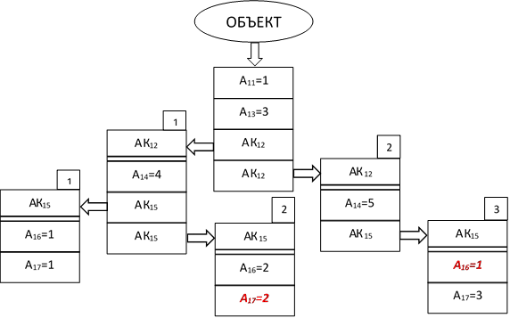

# Правила описания условных логических выражений

Условные логические выражения используются в ПК «ГИС Нева» при выполнении следующих действий над объектами:
+ анализ свойств объектов карты для их отбора в выборку;
+ анализ значений атрибутов на отсутствие ограничений по значениям;
+ анализ значений атрибутов на отсутствие ограничений для установления связей;
+ анализ значений атрибутов для применения различных условных знаков при отображении объекта.

Логическое выражение используется для проверки условия, при выполнении которого производятся какие-то действия над объектом или наоборот – не производятся, поэтому оно получило название – условное.

Условное логическое выражение состоит из набора аргументов, объединяемых в выражение с помощью логических операций:

& &nbsp;&nbsp;— И (логическое умножение)
! &nbsp;&nbsp;&nbsp;&nbsp;— ИЛИ (логическое сложение)

Аргументы логического выражения, между которыми расположены символы логических операций («&» или «!») должны обязательно заключаться в круглые скобки:
(Аргумент_1)&(Аргумент_2)&((Аргумент_3)!(Аргумент_4))

В качестве аргументов используются логические утверждения, принимающие значения true (истина) или false (ложь). Каждое логическое утверждение представляет собой операцию сравнения вычисляемого значения какого-либо свойства объекта с числовой константой. Вычисляемые свойства описываются переменными или функциями, т.е. в левой части утверждения стоит переменная или функция, в правой – значение числовой константы, а между ними операция сравнения:

= &nbsp;&nbsp;&nbsp;&nbsp;— равно
<> &nbsp;&nbsp;— не равно
> &nbsp;&nbsp;&nbsp;&nbsp;— больше
< &nbsp;&nbsp;&nbsp;&nbsp;— меньше
>= &nbsp;&nbsp;— больше или равно
<= &nbsp;&nbsp;— меньше или равно

Вычисляемыми с помощью переменных и функций свойствами объекта являются: тип объекта, значение какого-либо атрибута, количество точек метрики, длина и т.п.

## Вычисляемые переменные и функции

Вычисляемые переменные и функции связаны с каким-либо свойством объекта, атрибута или связи.

Переменная обозначается символом латинского алфавита (заглавным или строчным), перед которым ставится знак «@», например, @u, @t и т.п.

Функция обозначается набором латинских символов и имеет аргумент, который указываются в скобках после обозначения функции, например, func(A) – функция с именем «func» и аргументом для её вычисления – A.

Мнемоника логического утверждения: @A>5, т.е. если вычисленное значение переменной A больше 5, то утверждение – true, в противном случае – false.

Далее представлено описание переменных и функций для свойств объектов, их атрибутов и связей.

### Переменные для свойств объекта

| **Свойство объекта карты**                               | **Переменная** |
|----------------------------------------------------------|:--------------:|
| Код типа объекта (характер локализации) – см. [«Простые атрибуты»](object_dm.md#anchor6) | O              |
| Значение порога отображения                              | V              |
| Код цвета в соответствии с палитрой                      | I              |
| Уровень положения в иерархическом дереве                 | U              |
| Количество дочерних объектов                             | C              |
| Длина метрики объекта (в метрах местности)               | L              |
| Количество точек метрики объекта                         | N              |
| Площадь замкнутого контура объекта (в кв.м местности)    | S              |
| Наличие z-координат в метрике объекта                    | Z=1            |
| Отсутствие z-координат в метрике объекта                 | Z=0            |
| Установлен запрет на редактирование объекта              | F=0            |
| **Свойство текстового объекта (вид «Подпись»)** | **Переменная** |
| Текст размещен «над линией»                     | G=0 или Y=1    |
| Текст размещен «по линии»                       | G=1 или Y=2    |
| Текст размещен «под линией»                     | G=2 или Y=4    |
| Текст центрирован «плотный слева»               | H=0 или T=0    |
| Текст центрирован «разрядка по буквам»          | H=1 или T=1    |
| Текст центрирован «точка-буква»                 | H=2 или T=2    |
| Текст центрирован «вектор-буква»                | H=3 или T=3    |
| Текст центрирован «плотный справа»              | H=4 или T=4    |
| Текст центрирован «плотный по центру»           | H=5 или T=5    |
| Текст центрирован «разрядка по словам»          | H=6 или T=6    |
| Текст центрирован «выноска»                     | H=7 или T=7    |

Примеры логических утверждений для свойств объектов:

@u=3 &nbsp;&nbsp;&nbsp;&nbsp;&nbsp;— уровень положения в иерархическом дереве равен 3;
@c>0 &nbsp;&nbsp;&nbsp;&nbsp;&nbsp;— количество дочерних объектов больше нуля;
@o<>2 &nbsp;&nbsp;— характер локализации не равен 2;
@v<5 &nbsp;&nbsp;&nbsp;&nbsp;&nbsp;— порог отображения меньше 5;
@s>500 &nbsp;&nbsp;— площадь объекта больше 500 м^2^.

### Переменные и функции для свойств атрибутов

Основным свойством атрибутов является их значение. Для вычисления значений атрибутов вместо символа переменной указывается номер атрибута (характеристики) по Классификатору, например, @1 – для сравнения в логическом утверждении используется значение характеристики номер 1.

Пример логического утверждения:
@1>10 – значение числового атрибута номер 1 больше 10.

Для вычисления других свойств атрибутов используются функции, аргументом которых указывается номер атрибута. В приведенной ниже таблице в качестве аргумента функций указан символ «n», обозначающий номер атрибута.

| **Свойство атрибута**                                  | **Функция** |
|--------------------------------------------------------|:-----------:|
| Наличие атрибута с любым значением                     | nil(n)=0    |
| Отсутствие атрибута                                    | nil(n)=1    |
| Код типа атрибута (коды типов атрибутов см. Таблицу 3) | type(n)     |
| Атрибут со значением «unknown» - неизвестно            | unk(n)      |
| Комплексный (составной атрибут)                        | dt(n)       |
| Максимальное значение числового атрибута               | max(n)      |
| Минимальное значение числового атрибута                | min(n)      |
| **Свойство текстового атрибута** | **Функция** |
| Количество символов              | len(n)      |
| Все символы – цифры              | text(n)=1   |
| Все символы – строчные буквы     | text(n)=2   |
| Все символы – заглавные буквы    | text(n)=3   |
| Первый символ – цифра            | char(n)=1   |
| Первый символ – строчная буква   | char(n)=2   |
| Первый символ – заглавная буква  | char(n)=3   |

Примеры логических утверждений для свойств атрибутов:

nil(9)=0&nbsp;&nbsp;&nbsp;&nbsp;&nbsp;— есть 9-я характеристика;
nil(9)=1&nbsp;&nbsp;&nbsp;&nbsp;&nbsp;— отсутствует 9-я характеристика
text(100)=3&nbsp;&nbsp;&nbsp;&nbsp;— все символы в 100-й характеристике – заглавные буквы
char(601)=1&nbsp;&nbsp;&nbsp;&nbsp;— первый символ в 601-й характеристике цифра
char(601)=2&nbsp;&nbsp;&nbsp;&nbsp;— первый символ в 601-й характеристике строчная буква
type(7)=9&nbsp;&nbsp;&nbsp;&nbsp;&nbsp;— тип 7-й характеристики «string»
type(12)<>3&nbsp;&nbsp;&nbsp;— тип 12-й характеристики не «long»
len(9)<4&nbsp;&nbsp;&nbsp;&nbsp;&nbsp;&nbsp;— количество символов в строке 9 характеристики меньше 4
dt(301)=3&nbsp;&nbsp;&nbsp;&nbsp;&nbsp;— количество составных атрибутов с номером 301 равно 3
@1>80&nbsp;&nbsp;&nbsp;&nbsp;&nbsp;&nbsp;— значение 1-й характеристики больше 80
@4=127.5&nbsp;&nbsp;&nbsp;&nbsp;&nbsp;— значение 4-й характеристики равно 127.5

### Контекстный анализ содержимого текстовых атрибутов

Для текстовых атрибутов логическое утверждение проверяется операцией сравнения «=» – равно, т.е. значение строки текстового атрибута сравнивается с текстовой константой, которая всегда указывается в кавычках, например:

@9="Москва" – значение атрибута номер 9 совпадает с текстовой строкой «Москва».

В текстовой константе допускается использовать специальные символы «&#42;» и «?», обеспечивающие контекстное сравнение содержимого атрибута с константой:

@9="&#42;ква" – обозначает, что результат сравнения будет true, если три последние символа атрибута 9 равны «ква». Наличие любых символов перед тремя последними не имеет значения;

@9="Мос&#42;"– обозначает, что результат сравнения будет true, если первые три символа какого-либо слова строки атрибута 9 равны «Мос». Наличие любых символов после трёх первых не имеет значения;

@9="&#42;оск&#42;"– обозначает, что результат сравнения будет true, если внутри атрибута 9 есть три рядом стоящих символа «оск». Наличие любых символов до и после этих трёх не имеет значения;

@9="Мо&#42;ва" – обозначает, что результат сравнения будет true, если первые два символа атрибута 9 равны «Мо», а последние два символа атрибута равны «ва». Наличие любых символов между начальными и конечными не имеет значения.

Если имеет значение количество не сравниваемых символов, которые обозначаются символом «&#42;», то вместо «&#42;» используется символы «?», расположение каждого из которых обозначает только один не сравниваемый символ, например:

@9="Мос???"– обозначает, что результат сравнения будет true, если первые три символа атрибута 9 равны «Мос», а после них в строке атрибута расположено только три любых символа.

Если кавычки указаны без команды, например, @9="", то в этом случае будет производиться поиск 9-й характеристики, значение которой состоит только из пробелов.

Если необходимо провести контекстный анализ содержимого текстового атрибута на наличие в нём символа кавычек, то в этом случае в качестве внешних кавычек строки константы необходимо использовать одинарные кавычки, а внутри указать символ двойных кавычек, например:

@9='&#42;"&#42;' – поиск кавычки в любом месте текстового атрибута номер 9.

В текстовой константе также могут быть использованы служебные символы, управляющие режимом контекстного анализа строки:

"^" – указывает на поиск символов только с начала строки;
"^#" – обозначает, что в этом месте строки должна быть любая цифра, 
"^$" – обозначает, что в этом месте строки должна быть любая буква.

Примеры логических утверждений с использованием служебных символов:

@9="^Мос&#42;" – поиск символов в начале строки, если указать без ^, то будут отбираться так же строки, где «Мос» встречается в начале слов находящихся внутри строки.
@9="&#42;к^#" – в 9-й характеристике после буквы "к" должна стоять цифра.
@9="&#94;$&#94;#&#42;" – в значении 9-й характеристики есть рядом стоящие буква и цифра (например, М1).
@9="^$ &#42;" – значение 9-й характеристики начинается с отдельно стоящей буквы.
@9="&#42; ^$ &#42;" – в значении 9-й характеристики есть одна отдельно стоящая буква в середине строки.

### Логические утверждения для атрибутов перечислимого типа и атрибутов-связей с внешней базой данных

Особенностью атрибутов перечислимого типа является то, что для них в цифровой карте в качестве значения хранится не строковое значение, например, «асфальт», а числовой код строки таблицы базы данных, т.е. анализ значения атрибута перечислимого типа возможен в двух вариантах – для кодового значения строки и для текстового значения атрибута, хранящегося в таблице.

Например, если необходимо для атрибута типа «dbase» с номером 10, проверить значение кода, то логическое утверждение выглядит следующим образом:

@10=1 – 10 атрибут имеет значение равное 1.

А если необходимо проверить не значение кода, а текстовое значение строки, соответствующей этому коду, то логическое утверждение в этом случае выглядит следующим образом (добавляется символ «@» после номера атрибута):

@10@=«асфальт» – 10 атрибут имеет значение равное «асфальт».

В соответствии с установленной множественностью в Классификаторе для атрибутов перечислимого типа возможно как единственное значение, так допустима и множественность значений.

При составлении логического утверждения с анализом значений следует учитывать, что утверждения обычного типа на сравнение значений с константой можно использовать только для случаев, когда атрибут имеет ТОЛЬКО одно значение из списка (тип dbase), например:

@262=3 – 262 атрибут имеет только одно значение равное 3.

(@262=3)!(@262=5) – 262 атрибут имеет только одно значение – 3 или 5.

Выражение типа (@262=3)&(@262=5) всегда равно false, т.к. при допустимом одном значении оно не может быть равно 3 и 5 одновременно.

Для атрибутов перечислимого типа, допускающих множественные значения (типы list, enumw), необходимо использовать специальные мнемоники логического утверждения для следующих вариантов условий:

_1) Проверка наличия среди установленных указанных значений._

&nbsp;&nbsp;"3"->@262 – значения «3» входит в список установленных значений 262 характеристики.
&nbsp;&nbsp;"3,5"->@262 – значения «3» и «5» входят в список установленных значений 262 характеристики.

_2) Проверка отсутствия указанных значений среди установленных._
	
&nbsp;&nbsp;"3,5"->@262=0 – значения «3» и «5» отсутствуют в списке установленных значений 262 характеристики.

_3) Проверка, что установлены только указанные значения._
	
&nbsp;&nbsp;@262->"3,5" – 262-я характеристика содержит только значение «3» И «5» в списке значений.
&nbsp;&nbsp;@262->"3,5"=0 – 262-я характеристика содержит другие значения кроме «3» И «5» в списке значений.

### Логические утверждения для комплексных атрибутов

Обычное логическое утверждение для проверки значения атрибута оперирует номером атрибута, причём этот атрибут может быть только простого типа, для которого в карте существуют значения. Некоторые простые атрибуты находятся внутри комплексных и их использование в логических утверждениях выполняется специальным образом.

Особенностями комплексных атрибутов являются их следующие свойства:
1. Комплексные атрибуты не имеют собственных значений, т.е. их нельзя анализировать.
1. Имеют иерархическую внутреннюю структуру.

Таким образом, логическое утверждение для проверки значения какого-либо простого атрибута, входящего в состав комплексного, должно содержать описание «пути» в иерархическом дереве по всем вложенным комплексным атрибутам к конкретному значению простого атрибута для его анализа.

Этот путь до интересующего простого атрибута описывается в виде логического выражения, содержащего аргументы, указывающие номер комплексного атрибута и условие ветвления на каждом множественном значении атрибута. Общий вид логического выражения:

##(Агрумент_1)&(Аргумент_2)&….& (Аргумент_N)##

Структура написания «Аргумента»: (?N «пробел» (Условие)), где
?N – признак позиционирования на комплексный атрибут с номером N;
«Условие» – логическое выражение, являющееся условием выбора экземпляра комплексного атрибута N для ветвления. Это условие анализирует значения простых атрибутов, входящих в состав комплексных, среди которых проводится выбор.

«Условие» может быть оформлено в двух вариантах:

Пример **первого варианта** – логическое выражение проверки значения атрибутов: (@12=3)&(@24=2), т.е. выбрать тот экземпляр комплексного атрибута, в котором атрибут 12 равен 3 и при этом атрибут 24 равен 2.

**Второй вариант** – вместо логического выражения проверки значений простых атрибутов ставится единица, что означает без проверки значений атрибутов выбрать первый попавшийся экземпляр комплексного атрибута. Как правило, указание единицы в условии выбора используется в случае, когда заведомо известно, что комплексный атрибут представлен в одном экземпляре.

На рисунке представлена схема объекта с простыми атрибутами (обозначены An) и комплексными атрибутами (обозначены АКn).

В схеме выделены два простых атрибута: А17=2 и А16=1, входящие в состав комплексных атрибутов АК15 во 2 и в 3 экземпляры соответственно.

Логическое выражение для пути **к атрибуту А17=2** состоит из следующих аргументов:

(?12 @14=4) – выбрать из двух АК12 экземпляр, в котором А14=4
(?15 @17=2) – выбрать из двух АК15 экземпляр, в котором А17=2

Общий вид логического выражения для проверки значения 17 атрибута:

(?12 @14=4)&(?15 @17=2)

Логическое выражение для пути к **атрибуту А16=1** состоит из следующих аргументов:

(?12 @14=5) – выбрать из двух АК12 экземпляр, в котором А14=5
(?15 1) – выбрать первый попавшийся экземпляр АК15

Общий вид логического выражения для проверки значения 16 атрибута может иметь вид:

(?12 @14=5)&(?15 1)&(@16=1) или 
(?12 @14=5)&(?15 @16=1)

Использование в логическом выражении конструкции «? N» (знак вопроса с номером атрибута) означает позиционирование на комплексном атрибуте, т.е. «шаг вниз» в иерархическом дереве атрибутов. После выполнения этого шага вниз может выполняться анализ только тех атрибутов, которые расположены на этом уровне иерархии. Если в одно логическое выражение необходимо включить анализ содержимого нескольких комплексных атрибутов, расположенных на одном уровне, то после описания условия для одного комплексного атрибута необходимо выполнить перемещение на самый верхний уровень иерархии («вынырнуть») и заново позиционироваться на другой атрибут. Конструкция для перемещения на верхний уровень иерархии имеет вид (?0 1).

На рисунке ниже представлена схема объекта с двумя комплексными атрибутами (4 и 5). Логическое выражение условия проверки двух простых атрибутов (18 и 15), расположенных внутри разных комплексных выглядит следующим образом:

(?4 @18=1)&(?0 1)& (?5 @15=5)

### Функции для свойств связей между объектами

Cвязи обладают свойствами:
+ тип связи (ассоциация, агрегация, композиция);
+ тип роли (исходный, целевой);
+ акроним связи (роли).

Функции для анализа свойств связей приведены в таблице, где
role_type — тип связи – целое число;
role_name — акроним связи (роли) – текстовая строка.

| Свойство связи                                                                                                      | Функция          |
|---------------------------------------------------------------------------------------------------------------------|:----------------:|
| Количество у объекта целевых связей (акроним и тип связи не имеют значения)                                         | dst              |
| Количество у объекта исходных связей (акроним и тип связи не имеют значения)                                        | src              |
| Количество связей указанного типа (ассоциация-1/агрегация-2/композиция-3), когда объект  в качестве целевого класса | dst(role_type)   |
| Количество связей определённого типа в качестве исходного класса                                                    | src(role_type)   |
| Количество связей с определённым акронимом роли целевого класса                                                     | dst("role_name") |
| Количество связей с определённым акронимом роли в качестве исходного класса                                         | src("role_name") |

Примеры логических утверждений для свойств связей:

dst(2)=2 – у объекта две связи типа «агрегация» в качестве целевого класса;
src("Link")>0 – у объекта есть хотя бы одна связь с акронимом «Link» в качестве исходного класса;
dst("")=0	– у объекта нет никаких связей в качестве целевого класса.