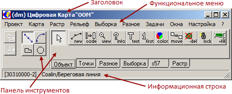
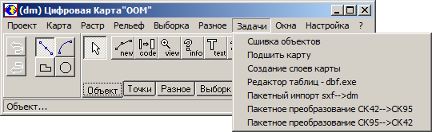
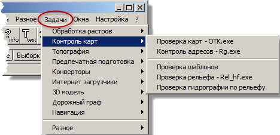
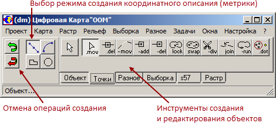

# Основное меню головного программного модуля

Основное меню открывается при запуске головного программного модуля и выглядит, как представлено на рисунке: {#anchor1}



Основное меню состоит из четырёх составных элементов:
+ Заголовок
+ Функциональное меню
+ Панель инструментов работы с объектами
+ Информационная строка

## Заголовок

Заголовок основного меню содержит постоянный текст: 
«##(dm) Цифровая Карта##», после которого в кавычках отображается имя текущей рабочей папки (в примере – «##ООМ##» на рисунке [основного меню головного программного модуля](#anchor1)).

## Функциональное меню

Функциональное меню состоит из наименований выпадающих меню, которые обеспечивают выполнение операций:
+ **Проект** – создание и управление проектом (набором карт, растров);
+ **Карта** – создание и выполнение операций с файлами цифровых карт;
+ **Растр** – открытие и выполнение операций с файлами растровых изображений;
+ **Рельеф** – создание и выполнение операций с файлами рельефа местности;
+ **Выборка** – работа с выборками объектов;
+ **Разное** – вызов различных операций работы с картами и табличными данными;
+ **Задачи** – настраиваемое меню вызова программных приложений (появляется в функциональном меню только при наличии в папке WORK файла task.###, содержащего [описание подключаемых программных приложений](#anchor2));
+ **Окна** – открытие различных окон редактора;
+ **Настройка** – выполнение операций по установлению опций отображения и обработки информации, вызов программ редактирования файлов Классификатора;
+ **?** – вызов справки о программе.

## Настройка вызова программных приложений {#anchor2}

Настройка вызова программных приложений заключается в описании в текстовом файле с именем task.### вызываемых программных приложений. Файл настроек должен быть размещён в папке WORK внутри текущей рабочей папки.

Пример содержимого файла task.###:
```
dm_util1.dll $dm_lace_all "Сшивка объектов"
dm_util1.dll $dm_lace_map "Подшить карту"
dm_util.dll #dm_layers_on_list "Создание слоев карты"
dbf "Редактор таблиц - dbf.exe"
"sxf_dm.bat /nocmd" "Пакетный импорт sxf-->dm"
"s42_95.bat /nocmd" "Пакетное преобразование СК42-->СК95"
"s95_42.bat /nocmd" "Пакетное преобразование СК95-->СК42"
```
Каждая строка содержит описание вызова одного приложения, которое состоит из трёх частей, разделённых пробелом. В начале строки указывается имя файла приложения (это может быть dll-библиотека или исполняемый exe-файл). Для dll-библиотеки, после её имени, указывается имя вызываемой из неё процедуры, затем через пробел в кавычках – отображаемое в головном меню наименование приложения. На рисунке ниже приведено изображение выпадающего меню «Задачи» для приведённого выше файла task.###:



Если требуется формировать группы задач по теме или создавать разделы в списке, то можно использовать символы «#» и «-». Символ «#» обозначает начало и конец группы, если заголовок группы содержит пробелы, строка с заголовком убирается в кавычки. Символ «-» разделяет строки списка чертой. Пример содержания файла «task.###» с разделами и группами задач:
```
"#Обработка растров"
Tiff "Преобразование растров - Tiff.exe"
Divw "Цветоделение растра - Divw.exe"
msk67p "Нарезка растра по объектам карты - Msk67p.exe"
PP "Работа с фотопланами - PP.exe"
#
"#Контроль карт"
otk "Проверка карт - OTK.exe"
rg "Контроль адресов - Rg.exe"
-
dll_txt1.dll $dm_err_ft "Проверка шаблонов"
rel_hf.exe  "Проверка рельефа - Rel_hf.exe"
dll_rel.dll $dm_rlz_blue "Проверка гидрографии по рельефу"
#
#Топография
ADD_BLD "Создание домов в кварталах - ADD_BLD.exe"
Frame_SXF "Создание координатной сетки - Frame_SXF.exe"
rel_dmw "Построение горизонталей - Rel_dmw.exe"
#
```
На рисунке ниже показан выпадающий список меню «Задачи», где задачи распределены по разделам:



Вызываемые программные приложения должны быть размещены в папке BIN вместе с головным программным модулем DMW.EXE.

## Панель инструментов редактирования

На панели инструментов размещены три группы кнопок, предназначенных для выполнения операций создания и редактирования объектов цифровых карт:



Первая группа содержит кнопки, выполняющие команды:

