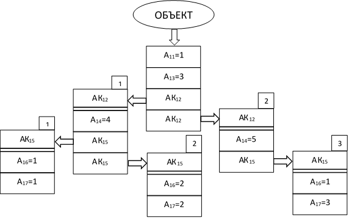

# Объект цифровой карты

Основной структурной и информационной единицей цифровой карты является объект. Информационная модель объекта в виде UML-диаграммы классов представлена рисунке: {#anchor2}

Информационная модель содержит описание класса объекта, его типов, пространственного положения и атрибутивного описания.

Правила чтения UML-диаграмм описаны [здесь](#anchor)

## Виды объектов

ПК ГИС «Нева» поддерживает обработку пяти видов объектов:
1. Пространственный объект (геообъект)
1. Объект «Меню»
1. Объект – «Координированный атрибут (Атрибут)»
1. Информационный объект (Информация)
1. Объект – «Подпись»

На [UML-диаграмме](#anchor2) все виды объектов наследуют от абстрактного класса «Описание класса объекта» общее классификационное описание, состоящее из трех атрибутов:
+ классификационный код – обязателен;
+ наименование класса – не обязательно;
+ акроним класса – не обязательно.

Класс объекта обязательно описывается уникальным, в пределах Классификатора, значением классификационного кода – восьмисимвольная строка, первым символом которой может быть символ цифры или буквы латинского алфавита, а на позициях со 2 по 8 могут размещаться только символы цифр. Как правило, в целях удобства использования значения классификационных кодов формируются по иерархическому принципу от старшего левого разряда кода к правому восьмому разряду кода.

Символьный акроним – мнемоническое обозначение класса объекта с использованием латинских символов. Как правило, набор символов соответствует смысловому значению класса объекта. Количество символов в акрониме не ограничено.

Название класса объекта отображает его смысловую сущность и может быть произвольной строкой.

На рисунке представлено классификационное описание объекта древесной растительности, отображаемое в информационной строке главного меню программы:

Данное описание состоит из следующих полей:
+ 70100000 – код объекта;
+ 3 – код характера локализации (типа) объекта (описание см. [здесь](#anchor));
+ WdVeg – акроним;
+ Растительность древесная – название класса.

Вид объекта устанавливается при его создании в Редакторе Классификатора. На следующем рисунке показано меню классификационного описания объекта, в котором для объекта выбирается одно из трех значений:
+ **Объект** – для объектов вида:
    + Пространственный объект
    + Меню
    + Подпись
+ **Информация** – для информационного объекта
+ **Атрибут** – для объекта «Координированный атрибут»

Уточнение выбранного вида «Объект» – пространственного, типа меню или подпись выполняется при установлении его характера локализации (тип объекта). Характер локализации объекта определяет тип его координатного описания – в виде одной точки, линии или замкнутого контура, огибающего область. Характер локализации устанавливается в меню классификационного описания объекта путём выбора одного из четырёх значений.

В меню классификационного описания ниже строки выбора вида объекта расположены четыре пиктограммы, нажатием на которые устанавливается характер локализации:

 — знак
 — линия
 — область
 — выбор типа объекта «Подпись» или «Текст»

Характеры локализации знак, линия и область могут быть выбраны для пространственного объекта или координированного атрибута, причём одновременно может быть выбрано несколько значений, т.е. объект данного класса может быть создан с любым типом координатного описания.

### Пространственный объект (геообъект)

Пространственный объект или ГеоОбъект обязательно имеет описание своего пространственного положения и может иметь описание свойств в виде неограниченного набора атрибутов различного типа.
Пространственное положение объекта (см. dataType «SpatialLocation» на [UML-диаграмме](#anchor2)) может быть описано двумя способами:
+ с помощью координатного описания одного из видов локализации;
+ без координатного описания путём установления связей с другими пространственными объектами, имеющими координатное описание.



Объектом типа «Знак» могут создаваться пространственные объекты, положение которых можно описать одной координированной точкой – **точечный объект**. Такие объекты отображаются с помощью условных знаков, имеющих одну точку привязки. Объект этого типа может содержать вторую координированную точку, выполняющую вспомогательную функцию – указание вектора направления наклона условного знака объекта и его размера при визуализации. В этом случае такой объект карты иногда называют **векторным объектом**.

На карте объект типа «Знак» изображается неориентированным (точечным) или ориентированным (векторным) условным знаком. Неориентированный условный знак описывается одной точкой, соответствующей точке привязки. Ориентированный (векторный) условный знак описывается двумя точками, при этом вторая точка (точка направления) используется для задания направления и размера условного знака.

Кроме того, условный знак может быть **масштабируемым**, **не масштабируемым** и **частично масштабируемым**.

Размер масштабируемого условного знака зависит от расстояния между точкой привязки и точкой направления и может быть пропорционально изменен путём перемещения этой точки.

Размер не масштабируемого условного знака является фиксированным на карте, т.е. он всегда занимает на карте место, соответствующее на местности его высоте, умноженной на паспортный масштаб карты. При перемещении точки направления изменяется только ориентация не масштабируемого знака, размер остаётся фиксированным.

У частично масштабируемого условного знака высота знака фиксирована, а ширина определяется расстоянием между точкой привязки и точкой направления.

Характер масштабируемости знака определяется при его создании в редакторе векторных знаков:
+ если в поле «высота» не указана или указано нулевое значение, знак будет масштабируемым;
+ если в поле «высота» указано положительное значение, знак будет не масштабируемым;
+ если в поле «высота» указано отрицательное значение, знак будет частично масштабируемым, и высота знака равна абсолютному значению указанной величины.

Масштабируемый и не масштабируемый знаки изменяют размеры при изменении увеличения карты в окне «Редактор».

Примеры точечных объектов: геодезические пункты, ориентиры, подводные камни и др.





Объектом типа «Линия» описываются линейно-протяженные пространственные объекты, для которых координатное описание может быть сформировано вдоль объекта по его оси.

Такие объекты отображаются на карте в виде линии определённого стиля и цвета.

В зависимости от направления цифрования линейные объекты делятся на две группы:
+ с произвольным направлением цифрования;
+ с фиксированным направлением цифрования.

Цифрованию в произвольном направлении подлежат объекты, последовательность координат которых не имеет значения при дальнейшем использовании информации, связанной с данным объектом (трубопроводы, ЛЭП, и т.п.).

Фиксированное направление цифрования имеют объекты, графическое изображение которых на топографической карте связано с:
+ различием высот местности по сторонам этих объектов (горизонтали, обрывы и т.п.) – такие объекты описываются по правилу «бо́льшая высота слева»;
+ разными высотами концевых точек (например, река) – эти объекты описываются по правилу «первая точка имеет бо́льшую высоту».

Примеры линейных объектов: горизонталь, дорога, река.





Объект типа «Область» или площадной объект (полигон, область) – это объект, выражающийся на местности в масштабе карты по длине и ширине, т.е. может быть изображен в виде пространственной области по её границе.

Площадные объекты описываются последовательностью координат граничных точек области. Они всегда создаются и отображаются при создании замкнутыми (координаты первой и последней точки должны совпадать). Площадной объект может иметь внутренние контура – «дырки».

Примеры площадных объектов: лес, озеро, строение.

При векторизации (цифровании) может использоваться любое направление указания последовательности точек, поскольку после завершения цифрования объекта программа запишет в файл карты точки в фиксированной последовательности – внутренняя часть объекта слева.





Пространственный объект данного типа не имеет собственного координатного описания и при его создании он обязательно связывается с другим пространственным объектом, имеющим координатное описание.

Для объекта «без метрики» также используется название – «Группа». Создание объектов без метрики возможно только в цифровых картах объектной модели.

Установление флага «Без метрики» для пространственного объекта выполняется в основном окне Редактора классификатора, как представлено на рисунке:

Флаг «без метрики» может быть установлен одновременно с установкой каких-либо характеров локализации, т.е. такой объект можно создавать как без координатного описания, так и с координатным описанием. Выбор типа создаваемого объекта производится из разрешенного в Классификатора перечня в окне «Легенда»:

В данном примере в окне легенда для объекта «Административная единица» разрешены три типа его создания:

 — без метрики
 — знак
 — область

Выбран для создания тип «без метрики».

Объекты без метрики целесообразно создавать в тех случаях, когда они полностью повторяют метрику другого объекта или, когда граница объекта не может быть чётко координирована, но указанием ссылок на другие объекты местоположение описывается однозначно. Примером объекта без метрики является класс «Архипелаг», который однозначно образуется группой островов.



### Объект «Меню»

Объект вида «Меню» является абстрактным, т.е. объекта с таким кодом создать в карте нельзя. Он предназначен для группировки (агрегации) классов пространственных объектов в обобщающий класс. Например, все классы, описывающие объекты гидрографии, удобно объединить под обобщающим классом «Гидрография».

Такое обобщение удобно для группировки классов объектов в меню «Легенда», которое строится по иерархическому принципу, что позволяет достаточно быстро выбирать нужный класс объекта (его пиктограмму) для создания объекта в карте.

### Объект «Координированный атрибут» {#anchor3}

Объект вида «Координированный атрибут» или «Атрибут» является специальным видом объекта, предназначенным для указания пространственного положения значения какого-либо атрибута на пространственном объекте. Использование координированного атрибута исключает необходимость деления линейно-протяженных объектов в местах изменения каких-либо свойств. Например, материал покрытия автодороги изменяется на её протяжении, и без использования координированных атрибутов объект приходится делить в местах изменения материала покрытия, что нарушает основное положение объектно-ориентированного подхода – сохранение целостности пространственного объекта независимо от изменения его свойств в пространстве и во времени. При использовании координированного атрибута «материал покрытия» он «накладывается» на координатное описание автодороги без её разделения на участки. Для площадного объекта координированный атрибут может указывать область распространения какого-либо свойства внутри объекта. Например, участок непроходимого болота внутри общего болота, или область распространения определенной породы деревьев внутри массива древесной растительности.

На традиционных топографических картах также используется приём указания пространственного положения какого-либо свойства на основном объекте в виде отдельных условных знаков или подписей: значения урезов воды вдоль водотока, подписи различных значений относительной высоты вдоль обрыва или вдоль полосы леса и т.п. Подписи значений атрибутов объектов на картах размещают с учётом мест их фактических измерений.

Объект «Атрибут» обязательно «принадлежит» пространственному объекту типа «линия» или «область», имеет собственное координатное описание типа: точка, линия или область, которое обязательно согласовано с координатным описанием основного объекта. Помимо координатного описания объект-атрибут обязательно имеет атрибутивное описание в виде одного значения своего атрибута. С точки зрения внутренней структуры хранения информации объект «Атрибут» размещается «дочерним» к основному объекту и автоматически удаляется при удалении основного объекта.

Для удобства работы с объектами-атрибутами значение их классификационного кода целесообразно формировать по определённому правилу, например, первым символом кода может быть латинская буква «А», а в младших разрядах указывать номер атрибута: A0000032 – код координированного атрибута номер 32.

При выделении объекта-атрибута информация о нём отображается в информационной строке основного меню головного модуля, как представлено на рисунке:

В приведённом примере:
+ Номер атрибута – #46
+ Характер локализации – линия (2)
+ Акроним и название – widRoaWay/Ширина проезжей части

Объекты типа «Координированный атрибут» могут создаваться только в цифровых картах объектной модели. Если у объекта присутствует координированный атрибут, например, №&nbsp;32, то значение этого атрибута в некоординированном виде, т.е. целиком для объекта, запрещено и наоборот – наличие значения атрибута у объекта целиком исключает возможность создания для него координированного атрибута с этим номером.

Противоречащие друг другу значения одного атрибута не могут пересекаться своими координатными описаниями (например, в одном и том же месте автодороги не может быть асфальтовое и щебёночное покрытие, в одной и той же точке болото не может быть проходимым и непроходимым).

### Объект «Подпись»

Объект вида «Подпись» – также именуемый как «Текстовый объект», является специальным картографическим объектом, предназначенным для отображения на фиксированном месте в карте содержимого атрибутов пространственных объектов, например, собственного наименования. Однако, объект может создаваться в карте для размещения какой-либо подписи, не связанной с пространственными объектами.

Подпись имеет векторное описание, состоящее из одной точки или набора точек ломаной линии (как контур линейных объектов). Для хранения содержимого подписи в объекте всегда используется только один атрибут (характеристика) с номером 9 строкового типа.

На карте объект типа «Подпись» отображается строкой, у которой содержание соответствует набору символов, тип шрифта (величина, наклон) – выбранному коду текстового объекта, а направление и привязка – векторному представлению (текст на карте размещается вдоль заданной линии).

Если объект-подпись отображает значение атрибута какого-либо пространственного объекта, то целесообразно его хранить «дочерним» к этому пространственному объекту. Это облегчает процесс автоматического обновления подписей по информации из родительского объекта и исключает ошибочную ассоциацию подписи с другими объектами карты.

### Объект «Информация»

Информационный объект не имеет пространственного положения, т.е. для него нельзя создать координатное описание. Он создаётся для того, чтобы хранить дополнительное атрибутивное описание пространственного объекта, которое не целесообразно включать в состав основного. Для объекта в Классификаторе определяется основной набор атрибутов, которые необходимы большинству пользователей, но в то же время, для различных тематических (специальных) приложений объекту необходимо добавить различные наборы специальных характеристик, например, описать объект «Строение» характеристиками прочности конструкции. В этом случае основной набор атрибутов не расширяется, но создается специальный тематический информационный объект с набором дополнительных характеристик. Этот информационный объект связывается с основным объектом, но выдается по запросу специальных потребителей.

У пространственного объекта может быть несколько информационных объектов. Один информационный объект может быть связан с несколькими пространственными объектами.



Создание информационных объектов возможно только в цифровой карте объектной модели.



Поскольку информационные объекты не имеют координатного описания и могут быть не связаны с пространственными объектами, то обращение к ним невозможно через окно редактора, где отображаются все пространственные объекты. Для работы с информационными объектами используется окно «Проводник» (вызов с помощью CTRL+F5). Пример работы с информационным объектом в проводнике представлен на рисунке:

## Локальная и глобальная идентификация объекта

Объект цифровой карты при создании автоматически получает значение своего локального идентификатора, уникального в пределах карты.

**Локальный идентификатор ((locID или Локид))** – целое число (номер объекта), значение которого хранится в виде служебной характеристики с номером 1000. Номер объекта уникален только в пределах цифровой карты и в случае переноса объекта из одной карты в другую ему присваивается новое значение Локида.

Для обеспечения возможности глобальной, не зависящей от карты, идентификации объекта ему может быть присвоен глобальный уникальный идентификатор.

**Глобальный уникальный идентификатор (guID или Гуид)** – текстовая строка длиной 36 символов с уникальным случайным набором цифр и латинских букв. Присвоение объектам карты значения Гуидов выполняется при необходимости с помощью отдельной процедуры из библиотеки dll_dm2. При переносе объекта из карты в другую карту или в отдельную базу данных Гуид сохраняет свое значение и не теряет свойства уникальности. Хранится значение Гуида в служебной характеристике номер 999.

Удалить или изменить значение Локида и Гуида интерактивно невозможно.

## Атрибутивное описание

Описание свойств объектов выполняется в виде значений атрибутов пяти простых видов:
+ Текст
+ Целое число
+ Дробное число
+ Логический
+ Перечислимый

И одного сложного:
+ Составной или комплексный

Атрибуты описываются в программе Редактор бланков параметрами:
+ Номер атрибута (целое число) – обязательно
+ Тип атрибута (см. таблицу 3 для простых видов) – обязательно
+ Наименование атрибута (произвольная текстовая строка) – не обязательно
+ Акроним – не обязательно

Каждый класс объекта в Редакторе Классификатора ссылается на свой «бланк», расположенный в файле &#42;.bln Классификатора и являющийся описанием набора атрибутов, допустимых для данного класса объекта.

Если в составе атрибутов объекта есть составной атрибут, то он имеет тип «blank», т.е. ссылку (номер) на другой бланк этого файла, где описаны его атрибуты. Таким образом, один бланк вложен в другой и уровни вложенности не ограничены.

### Простые атрибуты {#anchor6}

В таблице представлен перечень и описание атрибутов всех простых видов по их типам, которые пользователь может включить в состав атрибутов для описания свойств объектов.

| № п\п | Тип атрибута | Код типа^*^ | Описание атрибута                                                                                                                                                                                                                                                                                                                                                                                                                                                           |
|-------|--------------|-----------|-----------------------------------------------------------------------------------------------------------------------------------------------------------------------------------------------------------------------------------------------------------------------------------------------------------------------------------------------------------------------------------------------------------------------------------------------------------------------------|
| 1     | string       | 9         | Текст – строка символов (один байт на символ)                                                                                                                                                                                                                                                                                                                                                                                                                               |
| 2     | text         | 17        | Текст – строка символов в кодировке Unicode (два байта на символ) и возможностью вставки в текст символов переноса строки.                                                                                                                                                                                                                                                                                                                                                  |
| 3     | latin1       | 23        | Текст – строка символов в кодировке расширенной латиницы latin1 (один байт на символ). Вариант атрибута типа text, но с 256 символами.                                                                                                                                                                                                                                                                                                                                      |
| 4     | rtf          | 24        | Текст – строка символов в RTF-формате. Значение атрибута заполняется внешними программами и только отображается, редактирование невозможно.                                                                                                                                                                                                                                                                                                                                 |
| 5     | time         | 4         | Длинное целое число значения времени в формате: чч:мм:сс (часы, минуты, секунды)                                                                                                                                                                                                                                                                                                                                                                                            |
| 6     | date         | 5         | Длинное целое число значения значение даты в формате: гггг.мм.чч (год, месяц, число)                                                                                                                                                                                                                                                                                                                                                                                          |
| 7     | byte         | 0         | Целое число длиной 1 байт в диапазоне [0…255]                                                                                                                                                                                                                                                                                                                                                                                                                               |
| 8     | word         | 1         | Целое число длиной 2 байта в диапазоне [0..65535]                                                                                                                                                                                                                                                                                                                                                                                                                           |
| 9     | int          | 2         | Целое число длиной 2 байта в диапазоне [-32000…32000]                                                                                                                                                                                                                                                                                                                                                                                                                       |
| 10    | long         | 3         | Целое число длиной 4 байта в диапазоне [–2147483648…2147483647]                                                                                                                                                                                                                                                                                                                                                                                                          |
| 11    | number       | 20        | Числовое интервальное значение: =&nbsp;&nbsp;&nbsp;– строгое равенство одному числу >&nbsp;&nbsp;&nbsp;– больше указанного числа <&nbsp;&nbsp;&nbsp;– меньше указанного числа >=&nbsp;&nbsp;&nbsp;– больше или равно указанному числу <=&nbsp;&nbsp;&nbsp;– меньше или равно указанному числу (....)&nbsp;&nbsp;&nbsp;– интервал значений, указанные границы входят в значение [....]&nbsp;&nbsp;&nbsp;– интервал значений, указанные границы не входят в значение !=&nbsp;&nbsp;&nbsp;– любое значение, кроме указанного Значение атрибута хранится в виде текстовой строки типа string |
| 12    | float        | 6         | Дробное число длиной 4 байта (8 значащих цифр)                                                                                                                                                                                                                                                                                                                                                                                                                              |
| 13    | single       | 7         | Дробное число длиной 4 байта (8 значащих цифр)                                                                                                                                                                                                                                                                                                                                                                                                                              |
| 14    | angle        | 8         | Дробное число длиной 8 байта (16 значащих цифр)                                                                                                                                                                                                                                                                                                                                                                                                                             |
| 15    | double       | 14        | Дробное число длиной 8 байта (16 значащих цифр)                                                                                                                                                                                                                                                                                                                                                                                                                             |
| 16    | logic        | 12        | Логическое значение – да/нет                                                                                                                                                                                                                                                                                                                                                                                                                                                |
| 17    | dbase        | 10        | 1. Перечислимый тип c возможностью выбора только одного значения из списка. 2. Связь со значением из таблицы внешней базы данных.                                                                                                                                                                                                                                                                                                                                           |
| 18    | list         | 16        | Перечислимый тип c возможностью выбора нескольких значений из простого списка.                                                                                                                                                                                                                                                                                                                                                                                              |
| 19    | enumw        | 21        | Перечислимый тип с возможностью выбора одного или нескольких значений из иерархического списка.                                                                                                                                                                                                                                                                                                                                                                             |
| 20    | enum         | 11        | Перечислимый тип с возможностью выбора одного значения из выпадающего списка, при этом список значений хранится непосредственно в бланке классификатора и редактирование списка доступно в редакторе бланков bln.exe. Особенностью данного типа является то, что список значений одной характеристики может быть разный для разных объектов. |
| 21    | unicode      | 15        | Хранение значений в кодировке unicode                                                                                                                                                                                                                                                                                                        |
| 22    | color        | 18        | Аналог int – целое число длиной 2 байта в диапазоне [-32000…32000], но редактирование как цвет объекта                                                                                                                                                                                                                                       |

^*^ Указанное в третьем столбце значение кода типа атрибута используется в условных логических выражениях анализа объектов карты.

### Атрибуты перечислимого типа {#anchor4}

Атрибутами перечислимого типа описываются качественные свойства объекта, которые могут принимать значения только из заранее установленного (предопределенного) списка (материал покрытия, тип водотока и т.п.).

Список значений (словарь) атрибута представляется в виде таблиц из двух столбцов. Первый столбец – код строки списка, второй – значение свойства в виде текстовой строки. Например, таблица атрибута «Материал покрытия» представленная на рисунке:

Строки в таблице отсортированы по возрастанию значений кодов. Код строки не может принимать нулевое значение.

В файле карты для атрибутов перечислимого типа хранится не значение свойства, а его код из таблицы.

Атрибуты перечислимого типа могут иметь иерархическую структуру (тип enumw), когда верхнее в дереве иерархии значение атрибута является обобщающим для дочернего списка значений. Пример атрибута иерархического типа «тип автодороги» приведён на следующем рисунке:

Обобщающие значения атрибута используются в случае отсутствия детальной информации о значении атрибута, например, известно, что автодорога «обслуживаемая», но не известен точно её тип.

Значение атрибута перечислимого типа может принимать сразу несколько значений из списка (типы list и enumw), например:
+ мост может быть изготовлен из нескольких видов материала;
+ период действия горного перевала – несколько указанных месяцев из общего списка календарных месяцев в году;
+ здание может иметь несколько функциональных назначений.

Для некоторых атрибутов может быть установлено только одно значение (тип dbase или enumw), например:
+ класс автодороги не может быть одновременно автострадой и грунтовой дорогой;
+ происхождение объекта либо естественное, либо искусственное.

Если для атрибута возможно только одно значение (тип dbase), то оно хранится в карте в виде числового значения кода строки из таблицы.

Если для атрибута возможно несколько значений из списка, то они хранятся в карте в виде текстовой строки типа string, в которой через запятую перечисляются значения кодов из таблицы.

Для атрибутов перечислимого типа таблицы со списками возможных значений, из которых пользователь выбирает требуемые, содержатся в файле Классификатора с расширением &#42;.mdb, являющимся внутренней базой данных Классификатора, в которой хранятся значения всех атрибутов перечислимого типа. Вместо базы данных MDB-типа таблицы со списками возможных значений могут быть представлены dbf-файлами на каждый атрибут и размещены в папке с именем DBF, расположенной рядом с папкой классификатора OBJ.

### Множественность и обязательность значений атрибутов

Свойство может быть присуще объекту целиком (например, собственное название) или иметь множественные значения, например:
+ ширина водотока не одинакова в различных его местах, что приводит к необходимости описывать местоположение этого свойства различными значениями на объекте (см. [«Координированный атрибут»](#anchor3));
+ здание может быть построено из нескольких видов материалов (см. атрибуты перечислимого типа list и enumw – [«Атрибуты перечислимого типа](#anchor4)).

Множественность значения атрибута описывается в поле «Множественность» в окне «Инспектор» Редактора бланков, как представлено на рисунке: {#anchor5}

Значение множественности одного и того же атрибута может устанавливаться для каждого класса объекта в виде допустимого минимального и максимального значений атрибута, например:
1. «0..*» – значения атрибута может не быть или может быть сколько угодно значений;
1. «0..1» – значения атрибута может не быть, но допускается только одно значение;
1. «1..*» – атрибут всегда должен иметь хотя бы одно значение;
1. «1» – атрибут всегда должен иметь только одно значение.

Если в описании множественности в качестве минимального значения указывается ноль – атрибут необязателен для данного класса объекта, в противном случае атрибут обязателен. Если поле «Множественность» не заполнено для атрибута, то это означает множественность – «0..*».

Если множественность значений атрибута больше единицы, то такой атрибут может быть координированным.

Обязательность атрибута для объекта, помимо множественности, описывается ещё в поле «Отсутствие», расположенном над полем «Множественность» ([рисунок «Установление множественности значения атрибута»](#anchor5)). Если поле отсутствие установлено в значение «Разрешено», значит объект может существовать без данного атрибута и нарушение множественности интерпретируется как ошибка Классификатора. Если же значение поля «Отсутствие» установлено в «Запрещено», то при создании объекта данного класса необходимо будет обязательно ввести значение данного атрибута. Если значение не будет введено, объект не будет записан в цифровую карту.

### Ограничения на значения атрибутов или сочетания значений

При описании класса объекта в Классификаторе для значений некоторых атрибутов могут быть введены ограничения, обусловленные, как правило, здравым смыслом. Например, можно ограничить максимальное и минимальное значение атрибута «Абсолютная высота» рельефа поверхности суши (от -27&nbsp;м до 8848&nbsp;м), или атрибут перечислимого типа, используемый несколькими классами объектов, – для объекта данного класса может принимать не все значения, содержащиеся в таблице базы данных.

Для одного класса объекта могут быть установлены ограничения на сочетания значений его атрибутов, когда атрибуты не могут одновременно принимать противоречащие друг другу значения или какой-либо атрибут не имеет смысла при определённом значении другого атрибута. 

Например, автомобильная дорога описывается двумя атрибутами: материал покрытия и тип автодороги. Если тип автодороги – «просёлочная», то в этом случае атрибут «материал покрытия» (асфальт/щебень/бетон) не может принимать никакого значения.

Наличие одного атрибута или его определённое значение может влиять на обязательность другого атрибута, т.е. при условии наличия или определенного значения одного атрибута другой становится обязательным. Например, если для автомобильной дороги указан тип – «шоссе», то атрибут «материал покрытия» можно считать обязательным.

Описание ограничений выполняется в виде условного логического выражения в Редакторе бланков.

### Составной/комплексный атрибут

Некоторые классы атрибутов целесообразно группировать с указанием для этой группы самостоятельного имени, например:
1. Для объекта «Паромная переправа» атрибуты, описывающие характеристики непосредственно парома (тип, грузоподъёмность, размеры) целесообразно объединить под одним атрибутом с именем «Паром».
2. Значение атрибута «Собственное название» может иметь два варианта написания – на русском и английском языке. Чтобы не вводить два различных класса атрибута, атрибут «Собственное название» можно описать отдельным типом данных, объединяющим два простых класса атрибута – «Текст написания названия» и «Язык написания названия». Сочетания их значений позволит иметь множество экземпляров одного собственного названия объекта на различных языках.

Составной/комплексный атрибут – атрибут, имеющий собственное имя (номер), значением которого является набор значений других атрибутов, как простых, так и составных.

Составной атрибут описывается самостоятельным типом – «blank».

На рисунке представлена схема организации атрибутивного описания объекта с простыми и комплексными атрибутами. Простые атрибуты обозначены An, комплексные – АКn, где n – номер атрибута.

Объект, представленный на рисунке, имеет следующий состав атрибутов:

1. 11 атрибут (простой) = 1
1. 13 атрибут (простой) = 3
1. 12 атрибут (комплексный) в двух экземплярах:
+ 1 экземпляр имеет в своём составе:
    + 14 атрибут (простой) = 4
    + 15 атрибут (комплексный) в двух экземплярах:
        + 1 экземпляр имеет в своём составе:
            + 16 атрибут (простой) = 1
            + 17 атрибут (простой) = 1
        + 2 экземпляр имеет в своём составе:
            + 16 атрибут (простой) = 2
            + 17 атрибут (простой) = 2
    + 2 экземпляр имеет в своём составе:
        + 14 атрибут (простой) = 5
        + 15 атрибут (комплексный) в одном экземпляре в составе:
            + 16 атрибут (простой) = 1
            + 17 атрибут простой = 3

С точки зрения внутренней структуры хранения информации комплексный атрибут записывается в карту в виде **служебного дочернего** объекта к основному. Тип этого объекта «attribute» и он имеет своё атрибутивное описание. Этот служебный объект не может иметь координатного описания.

### Использование атрибутов из таблиц внешних баз данных

Простой атрибут типа dbase связывается с таблицей из внутренней базы данных Классификатора с расширением &#42;.mdb в окне «Инспектор» Редактора бланков, как это представлено на рисунке. Имя таблицы в поле «Table» совпадает с номером атрибута в поле «Номер».

В поле «Столбец» указывается номер столбца (поля) таблицы, значение из которого будет отображаться в бланке атрибутов объекта.
При указании номера столбца следует учитывать, что столбцы сортируются по алфавиту написания своих имён, т.е. столбец с именем, состоящим из латинской буквы «A», будет иметь номер 1.

В некоторых случаях значения атрибутов объекта удобнее вести в таблицах внешних баз данных. Например, независимо от цифровых карт ведутся реестры для населённых пунктов – таблицы с большим количеством описывающих их атрибутов (несколько вариантов названий, тип, статус, численность населения и т.п.). Этими реестрами пользуются различные информационные системы и вести их удобно в одной базе данных для всех пользователей.

ПК «ГИС Нева» предоставляет возможность «связать» свои атрибуты с полями внешних баз данных для отображения в цифровой карте информации об объектах. Эти базы данных должны быть типа MDB и размещаться в папке с именем DB, находящейся внутри рабочей папки. Редактирование значения полей в этом случае выполняется только во внешней базе данных с использованием программы MS Access.

Для связи с внешней базой данных используется **атрибут-связь** типа «dbase».

В окне «Инспектор» Редактора бланков описывается связь этого атрибута с определённым полем таблицы внешней mdb-базы данных. Пример такой связи представлен на рисунке:

Связь описывается тремя значениями полей:
+ Database – имя файла базы данных;
+ Table – имя таблицы в базе данных;
+ Столбец – номер поля (столбца) в таблице.

Правило указания номера столбца такое же, как при описании связи с внутренней таблицей Классификатора. В цифровой карте в качестве значения такого dbase-атрибута хранится код выбранной строки таблицы, хранящийся в столбце (поле) номер 1.

Описанный механизм связи предполагает, что атрибут может быть связан только с одной таблицей в одной базе данных, т.е. это механизм прямого указания имён базы данных и таблицы.

При необходимости использования значений одного атрибута из нескольких таблиц или баз данных описание их имён выполняется косвенным способом заполнением только поля «Database» в окне «Инспектор», как показано на следующем рисунке:

В окне «Инспектор» в поле «Database» заполняется строка следующего содержания – «:bas_nam:tab_nam:col_nam», где
+ bas_nam – имя поля таблицы номер 99, в котором указано имя внешней базы данных;
+ tab_nam – имя поля таблицы номер 99, в котором указано имя таблицы во внешней базе данных;
+ col_nam – имя поля таблицы номер 99, в котором указано имя столбца (колонки) таблицы, откуда необходимо отобразить значение атрибута.

При этом заполняются поля соответствующей таблицы файла &#42;.mdb Классификатора. На рисунке ниже изображен фрагмент таблицы с номером 99 (для примера связи атрибута с внешними базами данных косвенным способом):

В этом случае в цифровой карте в качестве значения атрибута записывается составной номер строки таблицы, например, для рис. А и рис. Б значение атрибута 99=643.25, т.е. отображается значение поля «label» строки с номером 25 из таблицы «FederalRoads» базы данных «RussianRoads».

## Координатное описание объектов

Координатное описание объектов цифровой карты может быть представлено в одной из двух форм (моделей):
+ Картографическое «спагетти»
+ Цепочно-узловая структура (ЦУС)

Для каждой модели картографический редактор имеет свой набор функций для создания и редактирования координатного описания.

В карте могут одновременно присутствовать объекты в различных моделях, но экземпляр одного объекта может иметь координатное описание только в одной из моделей.

### Картографическое «спагетти»

Форма представления координатного описания пространственных объектов, где каждый объект цифровой карты имеет свое координатное описание одного из характеров локализации (точка, линия, область). Оно создаётся при создании объекта и удаляется из карты вместе с объектом.

Если пространственное положение объектов совмещено в пространстве (объекта «насыпь» и объекта «автодорога», административной границы и административной единицы и т.п.), то их координатное описание дублируется для каждого объекта и редактируется отдельно.

Объектная модель цифровой карты реализована для данной формы представления координатного описания.

Такая форма, в первую очередь, ориентирована на отображение объектов, когда их «личное» координатное описание «одевается» в условный знак. Топологическое согласование координатных описаний смежных объектов при этом обеспечивается специальными приёмами создания и редактирования метрики объектов, а также для этого необходимо использовать специальные процедуры автоматического контроля.

Для создания специальных цифровых моделей местности, ориентированных на автоматическое обеспечение полного топологического согласования координатного описания всех объектов карты используется модель «цепочно-узловая структура».

### Цепочно-узловая структура

Форма представления координатного описания пространственных объектов путём формирования общего для всех объектов графа, образованного координатными дугами (рёбрами), примыкающими начальными и конечными точками к объектам-узлам. Такой граф не допускает пересечения и дублирования дуг и узлов, а также отсутствия узлов в начальных и конечных точках дуг.

Координатное описание объекта представляет собой набор ссылок на рёбра и узлы. При этом объекты независимо друг от друга могут ссылаться на одни и те же дуги и узлы, чем и обеспечивается полное топологическое согласование пространственного положения объектов, поскольку изменение метрики дуги или узла означает редактирование в этот момент координатного описания всех объектов, которые на неё ссылаются.

Координатное описание объектов может быть преобразовано из одной модели в другую и обратно. При этом корректная модель ЦУС из «спагетти» может быть получена только в том случае, если в модели «спагетти» было обеспечено полное топологическое согласование метрик всех объектов.

### Z-координаты в метрике объекта

Каждой точке координатного описания может быть присвоено значение специального параметра – третьей координаты. В качестве третьей координаты могут использоваться значения: высоты, глубины и времени. Значения данных параметров присваиваются точкам координат при загрузке информации из внешних файлов или значение высоты и глубины может быть присвоено по информации открытых одновременно с картой растровых массивов матриц высот или глубин.

### Основное и дополнительное координатное описание объекта

Пространственное положение объекта, как правило, описывается в цифровой карте в виде одного координатного описания (метрика объекта), выражающегося координатами главной точки, или осевой линии, или замкнутой линии, проходящей по внешней границе объекта. Это координатное описание является основным, однако, иногда, особенно при подготовке цифровой карты для мультимасштабной визуализации или использования в информационно-расчётных задачах, возникает необходимость сформировать для пространственного объекта дополнительные координатные описания. Например, для населённого пункта имеют смысл два координатных описания – точечное, расположенное в его центре и площадное по его границе, для водотока – линейное координатное описание по оси водотока и площадное по береговой линии.

ПК «ГИС Нева» обеспечивает возможность формирования для пространственного объекта одного основного координатного описания и неограниченного количества дополнительных, которые могут быть созданы в дополнение к основному. При этом характер локализации дополнительных координатных описаний может быть любым из разрешенных для данного класса объекта в Классификаторе.

Дополнительное координатное описание также доступно для редактирования, как и основное, выбор объекта для редактирования его атрибутов можно осуществить, указав основное или любое дополнительное координатное описание. С точки зрения внутренней структуры хранения информации дополнительное координатное описание записывается в виде **служебного дочернего** объекта к основному. Этот дочерний объект имеет координатное описание, но не может иметь своего атрибутивного описания.

Дополнительное координатное описание может быть создано только в объектной модели карты и модели координатного описания типа «спагетти».

### Специальные типы координатного описания линий и областей

Для объектов типа «линия» и «область» возможно создание координатного описания специальных типов:
+ Эллипс
+ Кривая

Координатное описание типа «Эллипс» описывается координатами двух или трёх точек. Первая из них – центральная точка (пересечение малой и большой оси), вторая и третья – пересечение большой и малой осей с контуром эллипса. Как частный случай двумя точками описывается эллипс, выродившийся в окружность.

Координатное описание типа «Кривая» (Кривая Безье) описывается набором точек, обеспечивающих построение плавных кривых.

Специальные типы координатных описаний используются при векторизации объектов для обеспечения плавности (не «изломанности») полилиний. После векторизации они отдельной функцией редактора «line» могут быть преобразованы в классическую полилинию путём аппроксимации кривых с указанием порога аппроксимации. При выборе в карте объекта «эллипс» в информационной строке отображается значение характера локализации – 5, а при выборе объекта «кривая» в информационной строке отображается значение характера локализации – 6 (в случае линейного объекта) или 7 (в случае площадного объекта).

### Специальный тип объекта – «массив глубин»

В электронных навигационных картах в соответствии со стандартом S-57 предусмотрен специальный тип точечного объекта – «массив глубин». Объект такого типа описывает плановое положение и значения глубин набора точечных объектов – «отметок глубин». Координатное описание этого точечного объекта состоит из набора точек. Каждая точка соответствует одной отметке глубины - координаты X,Y описывают плановое положение отметки глубины, а значение Z-координаты является значением глубины в этой точке.

Атрибуты такого объекта являются общими для всех точек массива. При выборе такого объекта в информационной строке отображается значение характера локализации – 11. Преобразование набора точечных объектов «отметка глубины» в один объект «массив глубин» и обратно выполняется с помощью процедур «Собрать массив знаков» и «Разобрать массив знаков» библиотеки dll_cn.

## Описание и установление отношений (связей) между объектами

### Связи между объектами в картографической модели

Классификатор картографической модели не содержит описания отношений между классами объектов, однако структурная модель цифровой карты в виде иерархического дерева предполагает возможное установление связи между объектами карты типа «родитель»-«ребёнок», т.е. один объект может быть подчинён другому. При этом из-за специфики модели «дерева» для этой связи есть ограничение – объект может быть дочерним только к одному родителю и при этом никакой смысловой «окраски» для этой связи сохранить в карте нельзя. Смысловая трактовка связи содержится только в контексте классов родительского и дочернего объектов. Например, целесообразно объекты «Подпись» хранить в виде дочерних для основных объектов, значения чьих атрибутов подпись отображает. Картографические объекты-условные знаки (знак количества путей на железной дороге) также можно разместить как дочерние к самой железной дороге.

Установление связи «родитель»-«ребёнок» и её разрушение может быть выполнено с помощью специальных функций Редактора карты.

При удалении родительского объекта удаляются все его дочерние объекты.

### Отношения и связи между объектами в объектной модели

Установление связей между объектами в цифровой карте объектной модели выполняется в соответствии с описанием в Классификаторе допустимых отношений между классами объектов.

По степени взаимной зависимости классов объектов в отношениях они подразделяются на типы:
1. **Агрегация** – отношения части и целого (один объект является «контейнером/родителем» для другого, второй – «содержимое контейнера/ребёнок»).
Например, мост, как дорожное сооружение, является частью дороги (агрегата) и исполнение дорогой своих функций зависит от поведения (качества) моста. При этом мост как пространственный объект может существовать и вне дороги.
1. **Композиция** – сильная агрегация, когда зависимый объект не может существовать без основного объекта-родителя. 
Примеры: водопад является частью водотока и не может быть без водотока, просека является элементом леса и не существует без леса.
1. **Ассоциация** – простая связь, описывающая любые другие виды зависимости, в том числе и равноправные отношения объектов.
 
Например, реки и проходящие над ними мосты не подчинены друг другу, однако в своей ассоциации они влияют на судоходность водного транспортного пути по реке, устанавливая ограничение на высоту проходящих судов под мостами.

В общем случае в модели данных описание отношения выполняется указанием:
+ двух участвующих в нём классов (исходного и целевого);
+ наименованием роли, которую играет целевой класс для исходного класса;
+ множественности участия объектов целевого класса в данной роли для одного экземпляра объекта исходного класса.

Множественность исходного класса всегда равна единице, а множественность целевого класса, как правило, больше единицы. В агрегациях и композициях родительский класс является исходным, дочерний – целевым, т.е. в одном агрегате может быть много частей. В простой ассоциации, например, водотоков с мостами, через один водоток может проходить много мостов, т.е. водоток – исходный класс, а мост – целевой.

Описание отношения (связи) в ПК «ГИС Нева» выполняется в Редакторе Классификатора для объекта **исходного класса** путём указания класса целевого объекта с последующим описанием связи в специальном окне «Связь», изображённом на рисунке:

 между классами объектов")

На данном рисунке приведён пример описания отношения для класса «Автодорога» – исходный класс. Мостовое сооружение – целевой класс. Описание состоит из следующих полей (см. поля в окне сверху вниз):
+ Наименование и акроним отношения (разделены символом «/»);
+ Тип связи - «агрегация»;
+ Множественность объектов целевого класса [0…0], что означает необязательность связи и неограниченность количества целевых объектов для одного исходного (мостов может не быть на автодороге, или может быть сколько угодно);
+ Ограничения:
    + Семантика – условное логическое выражение для проверки допустимости связи в зависимости от значений атрибутов объектов целевого и исходного класса (например, пешеходный мост не может быть связан с автодорогой типа «шоссе»);
    + Топология – условие для проверки корректности топологии координатных описаний объектов исходного и целевого классов (все точки метрики моста должны быть совмещены с точками метрики дороги).

С точки зрения внутренней структуры хранения информации связь между двумя объектами записывается в карту в виде служебного дочернего объекта типа «связь» к основному объекту. Причём служебный объект «связь» записывается в двух экземплярах – объекту исходного класса (исходная связь) и объекту целевого класса (целевая связь). В виде атрибутов объект «связь» содержит информацию:
+ Ссылку на ответный объект связи: &nbsp;&nbsp;&nbsp;&nbsp;1001 атрибут (long) = Локид ответного объекта;
+ Код типа связи: &nbsp;&nbsp;&nbsp;&nbsp;1003 атрибут (byte): 1 – ассоциация, 2 – агрегация, 3 – композиция;
+ Признак исходной/целевой связи: &nbsp;&nbsp;&nbsp;&nbsp;1002 атрибут (byte): 1 – исходная связь (объект исходный в этой связи), 2 – целевая связь (объект целевой в этой связи);
+ Акроним и имя связи: 9 атрибут (string).

Для сохранения целостности информации о связях при переносе объектов из одной карты в другую, когда изменяются значения локальных идентификаторов, в связь отдельной процедурой должен быть записан атрибут guID (номер 999) ответного объекта.

### Координатное описание связи между объектами

Объект исходного класса «без метрики» создаётся путём установления его связей с другими объектами целевого класса, т.е. его пространственное положение описывается координатным описанием связанных с ним объектов целевого класса. В этом случае, как правило, объекты целевого класса участвуют в связи с объектом исходного класса целиком. Однако, например, если в качестве пространственного объекта формировать объект класса «Автомобильный путь в сети дорог», у которой один атрибут – значение номера дороги, то такой объект будет «без метрики» и в него по связям будут входить все автодороги и их участки, по которым эта «номерная» дорога проходит. Если какая-то автодорога не входит в номерную дорогу целиком, то можно указать ту её часть координатного описания, которая участвует в связи с «номерной» дорогой. В этом случае связь дороги «без метрики» с целевой дорогой будет сохранять координаты участвующего в связи участка.

Таким образом, связь получает свое координатное описание. С точки зрения внутренней структуры хранения информации для служебного объекта «связь» формируется метрика, как дубль фрагмента метрики объекта целевого класса. Если объект участвует в связи целиком, то метрика связи не формируется.

Реализация такой возможности формирования метрики для связи позволяет сохранять целостность объектов и не выполнять их деление для участия своими частями в связях с другими объектами.

## Кодовые обозначения видов и типов объектов

При работе с объектами цифровой карты во всех информационных строках, меню и окнах отображается их классификационный код и числовой код вида или типа объекта. Перечень числовых кодов видов и типов объектов представлен в таблице:

| Значение кода вида/типа объекта |   Вид/тип объекта                                                  |
|------------------------------------------|--------------------------------------------------------------------|
| 0                                        | Объект «Меню»                                                      |
| 1                                        | Пространственный объект типа «Знак»                                |
| 2                                        | Пространственный объект типа «Линия»                               |
| 3                                        | Пространственный объект типа «Область»                             |
| 4                                        | Объект «Подпись»                                                   |
| 5                                        | «Линия» или «Область» с координатным описанием типа «Эллипс»       |
| 6                                        | «Линия» с координатным описанием типа «Кривая»                     |
| 7                                        | «Область» с координатным описанием типа «Кривая»                   |
| 10                                       | Информационный объект                                              |
| 11                                       | Точечный объект «массив глубин»                                    |
| 21                                       | Пространственный объект типа «Знак» в цепочно-узловой структуре    |
| 22                                       | Пространственный объект типа «Линия» в цепочно-узловой структуре   |
| 23                                       | Пространственный объект типа «Область» в цепочно-узловой структуре |
| 30                                       | Объект «комплексный атрибут» (datatype)                            |
| 31                                       | Объект «координированный атрибут» точечной локализации             |
| 32                                       | Объект «координированный атрибут» линейной локализации             |
| 33                                       | Объект «координированный атрибут» площадной локализации            |
| 40                                       | Объект «связь» без координатного описания                          |
| 41                                       | Объект «связь» точечной локализации                                |
| 42                                       | Объект «связь» линейной локализации                                |
| 50                                       | Пространственный объект «без метрики»                              |
| 101                                      | Дополнительное координатное описание – точка                       |
| 102                                      | Дополнительное координатное описание – линия                       |
| 103                                      | Дополнительное координатное описание – область                     |
