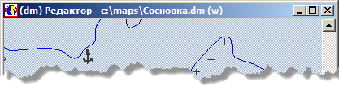

# Проект карт и активная карта

Понятие «Проект» введено для организации одновременной работы со многими картами, растрами, ортофотопланами, а также для обеспечения возможности сохранения нескольких вариантов настройки программы и выбора любого из них в следующих сеансах работы.

Под проектом понимается список карт и растровых файлов, загруженных в программу для работы, а также набор параметров, которые определяют режимы работы. Проект может быть сохранён в виде специального файла с расширением &#42;.prj на диск, а затем загружен в программу. При загрузке проекта восстанавливается то состояние программы, в котором она находилась в момент сохранения этого проекта. Это позволяет организовать работу с разными картографическими проектами на одном рабочем месте (в том числе и для разных пользователей). После загрузки проекта его настройки переходят в текущий проект.

Проект определяет следующие характеристики программы:
+ совокупность карт, загруженных в картографический редактор;
+ набор растров и фотопланов, загруженных в картографический редактор;
+ характеристики отображения карт, входящих в проект (опции, пороги отображения и др.);
+ размеры и положение окна отображения карт (окна редактора);
+ цветовые настройки окна редактора (подложка и активный объект);
+ масштаб отображения и положение участка проекта, видимого в окне редактора.

В проекте также можно запомнить несколько фрагментов (настроек масштабов отображения и положения участков проекта, видимых в окне редактора), и затем восстанавливать изображение любого из этих фрагментов в окне редактора одной командой.

Перед выходом программа сохраняет текущий проект на диске в специальном файле (dmw.###), а при последующем запуске автоматически загружает этот проект и восстанавливает то состояние, в котором она находилась в последнем сеансе работы.

В проекте все карты, загруженные в программу, рассматривается как единая область, имеющая определённые габариты и общую систему координат. Область отображения программы ограничена габаритами проекта. В проекте можно настроить уровни отображения каждой карты, а также запретить редактирование отдельных карт.

Такие операции, как создание новых карт путём вырезания участков из существующих, восстановление графики, построение выборок и другие, могут выполняться одновременно для всех карт проекта при условии включения опции «Все карты» на странице «Главная» в диалоге «Опции».

При создании новой карты или открытии существующей эта карта автоматически добавляется в текущий проект. При закрытии карты она удаляется из текущего проекта. И, наоборот, при добавлении или удалении карты в текущем проекте она открывается или закрывается в программе.

В то же время только одна карта из проекта доступна в каждый конкретный момент времени для редактирования – Активная карта. Остальные карты проекта доступны только для отображения. Имя файла и путь к активной карте отображается в заголовке окна редактора, как представлено на рисунке:

В проекции и системе координат активной карты отображаются все карты проекта.

Если опция «Все карты» в окне опций установлена, то для того чтобы сделать любую карту активной достаточно щёлкнуть левой кнопкой мыши, когда курсор находится над этой картой. Если эта опция сброшена, то для смены изменения активной карты нужно при нажатой клавише Alt щёлкнуть левой или правой клавишей мыши, когда курсор находится в площади нужной карты. Если указано левой клавишей мыши – переключение происходит на карту вниз по списку карт проекта, правой – вверх по списку.

Признаком изменения активной карты является изменение в заголовке окна редактора имени активной карты.

Все операции по работе с проектом реализуются командами из меню «Проект», а также в окне «Проект», которое открывается командой функционального меню «Окна» – «Проект» или горячей клавишей F2.