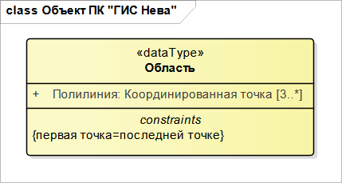
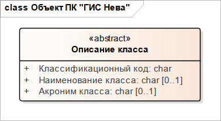
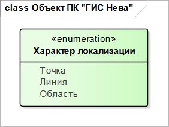
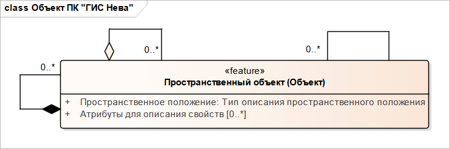
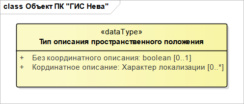

# Правила описания UML-диаграмм

Информационные модели объектов ООБГД представлены в виде графических UML-диаграмм, на которых в виде прямоугольных областей отображаются структурные элементы. Внутри прямоугольника содержится описание элемента. Элементы могут соединяться линиями различных типов, обозначающими связи между ними. {#uml}

Информационные модели объектов ООБГД представлены в виде графических UML-диаграмм, на которых в виде прямоугольных областей отображаются структурные элементы, как представлено на рисунке:

Внутри прямоугольника содержится описание элемента. Элементы могут соединяться линиями различных типов, обозначающими связи между ними:
+ идентификационная информация (верхняя секция с заголовком «dataType»);
+ описательная информация (средняя секция);
+ описание ограничений (нижняя секция с заголовком «constraints»).

Секция описания ограничений не является обязательной.

Основным элементом диаграммы является класс объекта.

## Описание классов объектов

Описание класса разделено на три секции:
+ идентификационная информация о классе
+ описания атрибутов
+ описание ограничений

Пример отображения класса объекта приведен на рисунке ниже:

Идентификационное описание класса объекта состоит из следующих полей:

+ **abstract** – тип класса. Возможные типы классов и их назначение:
    + **feature** – объект, который можно создать и записать в карту
    + **information** – информационный объект (специальный вид «объекта»)
    +  **abstract** – абстрактный класс, по которому нельзя создать объект в карте. Используется для объединения атрибутов и отношений (связей), которые наследуются связанными с ним классами
    + Описание класса – название класса
	
Ниже секции идентификационного описания расположена секция описания атрибутов, допустимых для данного класса объекта.

### Описание атрибутов

Описание каждого атрибута состоит из двух обязательных полей:
+ имя атрибута
+ тип атрибута (через двоеточие) после имени

и одного необязательного поля:
+ множественность атрибута (две цифры в квадратных скобках с двумя токами между ними)

### Описание типов атрибутов

Для каждого атрибута определяется его тип. Типы атрибутов делятся на две группы: простые типы и сложные типы.

Атрибуты простых типов: 
+ char – текст
+ byte, int, long, short – целые числа
+ double, float – дробные числа
+ boolean – логическое значение (да\нет)

Кроме простых типов используются сложные типы двух видов:
+ перечислимый тип – enumeration
+ составной тип или тип данных  - dataType

Каждый атрибут сложного типа имеет свое описание в отдельном элементе. В заголовке элемента содержится наименование его вида (enumeration или datype) и имя этого типа.

На рисунке ниже приведено изображение элемента атрибута перечислимого типа.

Атрибут «Характер локализации» может принимать одно из трёх значений: точка, линия, область.
Сложный тип используется для описания комплексных (составных) атрибутов, когда значением одного атрибута является набор значений других атрибутов.
Ниже на рисунке представлено описание класса «Пространственный объект», у которого есть комплексный атрибут «Пространственное положение»:

Тип этого атрибута имеет имя «Тип описания пространственного положения». Данный тип описан в отдельном элементе с заголовком «dataType» и названием типа:

Внутри элемента представлено два атрибута, которыми может быть описано «Пространственное положение»:
+ без координатного описания: boolean
+ координатное описание: характер локализации (перечислимый тип)

### Описание множественности атрибутов

Под множественностью атрибута понимается количество допустимых для него значений.

Описание множественности атрибута выполняется в виде двух чисел в квадратных скобках, расположенных после типа атрибута.

Первое число – минимальная множественность.

Второе число – максимальная множественность.

Минимальная множественность «0» означает, что ни одного значения атрибута для объекта может не быть, т.е. атрибут необязательный. Не равное нулю значение минимальной множественности означает, что не менее такого количества значений атрибута должно быть у объекта, т.е. атрибут обязательный.

Число максимальной множественности ограничивает количество возможных значений атрибута у объекта.

Примеры:

:   [0..1] – атрибут необязательный, но не более одного значения
:   [1..3] – атрибут обязательный, но не более трёх значений
:   [0..*] – атрибут необязательный, но количество значений не ограничено

Если множественность для атрибута не указана, то это означает, что и минимальное и максимальное значение множественности равно 1, т.е. [1..1], и в этом случае обязательно одно значение атрибута.

## Описание отношений между классами

Для описания отношений между классами используются линии, соединяющие элементы описания классов.

На рисунке представлен пример описания отношений (связей) между классами объектов в UML-диаграммах.

 между классами объектов")

Линия между классами Class1 и Class4 описывает отношение простой ассоциации между ними. Это равноправная связь между классами, т.е. никто никому не подчинён и не является его элементом. В месте примыкания линии связи к элементу класса может указываться имя роли, которую играет этот класс для противоположного класса в этом отношении. Около имени роли может указывается допустимая множественность данного класса объекта для противоположного. На рисунке объект Class4 играет роль r1 для объекта Class1 и в данном отношении множественность 0..1 означает, что объект Class1 может не иметь связи с объектом Class4, но если связь есть, то не более чем с одним объектом Class4.
 
Линия между объектами Class3 и Class5 другого типа (с ромбом на одном из концов линии) обозначает тип отношения между объектом Class3 и Class5 – агрегация, т.е. объекты класса Class5 являются составными элементами объекта Class3. Class5 играет роль r2 для Class3, а множественность [0..*] означает, что у объекта Class1 может не быть составных элементов Class5, но может быть и количество таких элементов не ограничено.

Линия между объектами Class2 и Class6 – ромб чёрного цвета, что означает наличие связи типа «композиция» между этими классами. Композиция – сильная агрегация, т.е. объект Class6 является элементом объекта Class2, но он не может существовать отдельно от объекта Class2.

Линии между объектами Class1 и Class2, так же, как и между Class1 и Class3, обозначают отношение наследования, т.е. один класс наследует от другого все его атрибуты и связи. В данном примере объекты Class2 и Class3 наследует от объекта Class1 атрибут «атрибут1», описанный для Class1. Кроме того, эти объекты Class4 связь объекта Class1, т.е. для Class2 и Class3 допустима связь с объектом Class4 с ролью r1.