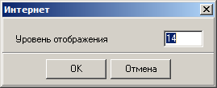

# Отображение цифровых карт

## Отображение объектов – общие сведения

Объекты карты отображаются в окне Редактора программы в соответствии с их расположением на карте. Порядок отображения объекта определяют следующие факторы:
+ характер локализации;
+ условный знак или параметры отображения, назначенные конкретному объекту на карте;
+ опции отображения карты (устанавливаются пользователем);
+ последовательность вывода слоёв карты и объектов на экран (определяется программой и пользователем);
+ механизм скрытия слоёв (управляется пользователем);
+ пороги отображения (задаются пользователем).

Работа с объектами карты осуществляется с помощью инструментов, расположенных на многостраничном поле панели инструментов в главном окне программы.

### Класс объекта

Под классом объекта в данном документе понимается совокупность классификационного кода и характера локализации объекта. Все объекты данного класса имеют, как правило, одинаковый условный знак, за исключением тех объектов одного класса, у которых условное графическое отображение зависит от их семантического описания. В каждом классификаторе может присутствовать только один объект определённого класса.

### Условный знак

Условный знак – это набор и конкретные значения признаков, определяющих изображение объектов одного вида на экране монитора. Набор признаков определяется характером локализации объекта и семантическим описанием объекта, а способ визуализации данного набора устанавливается в классификаторе.

Программа позволяет назначить конкретному объекту на карте параметры изображения, отличающиеся от условного знака объектов этого вида, с помощью инструмента «Изменить графику объекта»  из вкладки «Объект» на панели инструментов.

### Настройка отображения названия объекта

Опции «Акроним» и «Название» в списке главного меню «Настройка»–«Название объекта» определяют, что будет отображаться в строке подсказки Редактора при активации объекта в карте и в верхней строке Легенды карты при выборе объекта в списке Легенды. Данные опции задействуются в классификаторах, где в качестве разделителя в названии объектов используется символ «/», который является разделителем позиций текста для данной опции, а так же в новых классификаторах, где используются акронимы объектов. Пример работы опций представлен на рисунке:

 
## Порог (уровень) отображения

Поскольку цифровая карта может отображаться в различных масштабах, то порог отображения определяет нижнее (самое большое) значение масштаба, с которого начинает отображаться на экране определённый объект, слой или карта целиком. Наличие порогов позволяет управлять нагрузкой карты при разных увеличениях и избегать перенасыщенности изображения мелкими или избыточными деталями (генерализация). Порог может быть назначен для всей карты, входящей в проект, для определённого слоя или для конкретного объекта карты. Далее под объектами понимаются карты, слои и объекты карты.

Пороги измеряются в единицах отношения размеров текущей карты к размерам участка карты, который отобразили бы в окне, развернутом во весь экран, при данном увеличении.

Нулевое значение порога означает, что объект отображается всегда.

Если включена опция «Все объекты» в опциях отображения, то пороги отображения игнорируются и все объекты отображаются при любых масштабах.

Управление порогами отображения карт описано ниже.

## Окно отображения карты (Редактор)

Окно «Редактор» служит для отображения карты с возможностью изменения масштаба изображения объектов карты и навигации (передвижения) по карте. В данном окне осуществляются непосредственные действия по созданию, выбору и редактированию объектов.

Окно имеет следующий вид:

На верхней рамке окна «Редактор» отображается информация о названии активной карты проекта и служебная метка карты.

Обозначения служебных меток карты:
+ (x) – в карте нельзя создать объекты в цепочно-узловой структуре, т.е. возможны только объекты типа «картографическое спагетти»;
+ (o) – в карте могут присутствовать объекты в цепочно-узловой структуре;
+ (w) – в карте возможна работа с номерами характеристик больше 1024 (в версиях ПК «Нева» до 2014 года работа с большими характеристиками возможна только при запуске программы с ключом «/hf16»).

На нижней рамке окна «Редактор» находится набор инструментов, предназначенных для увеличения, уменьшения и перемещения изображения внутри окна, измерения расстояния, а также строка отображения координат, позволяющая отображать информацию в нескольких режимах.

## Координатная строка

Поле «Координаты» служит для отображения координат текущей позиции курсора в окне Редактора карт. При запуске программы данное поле всегда находится в режиме показа координат, но в дополнение к указанной функции его возможно переключить на следующие режимы работ:
+ Режим «Координаты»
+ Режим «Масштаб»
+ Режим «Линейка»

Переключение режима производится в диалоге, который вызывается нажатием правой клавиши на координатной строке:

### Режим «Координаты»

Координатная строка в режиме отображения масштаба выглядит следующим образом:

Нажав кнопку  в строке «Масштаб», можно выбрать вариант фиксированного масштаба из списка:

Кнопками  и  можно переключать масштабы вверх и вниз по списку, не вызывая самого списка.

Внизу списка масштабов находится команда «Интернет уровень…», открывающая диалог выбора уровня отображения в соответствии с принятыми для WEB-среды масштабами:

Ниже команды «Интернет уровень…» есть возможность задания проекции, применяемой для отображения данных с интернет-ресурса:
+ mercator
+ geodetic
+ google

### Режим «Масштаб»

### Режим «Линейка»

## Увеличение масштаба

## Уменьшение масштаба и работа с инструментом «Линейка»

## Перемещение изображения («Передвинуть точку»)

## Перерисовка окна

## Отображение набора карт

## Управление набором векторных карт – команды меню «Проект»

## Управление набором пространственных данных – окно «Проект»

## Навигация по карте – Окно «Обзор»

## Увеличение фрагмента карты – окно «Лупа»

## Закладки для изображений

## Настройки параметров отображения

## Контекстное меню работы с активным объектом

## Контекстное меню в режиме создания нового объекта

## Окно выбора объекта «Легенда»

## Управление слоями карты – окно «Слои»

## Управление отображением атрибутов (виртуальные знаки и подписи)

## Управление отображением координированных атрибутов

## Настройка ассоцииации файлов карт *.dm с программой dmw.exe

## Окно «Просмотр…»
