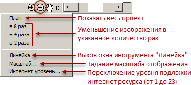
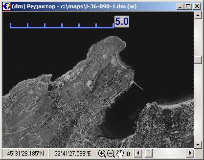
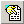
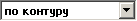

# Отображение цифровых карт

## Отображение объектов – общие сведения

Объекты карты отображаются в окне Редактора программы в соответствии с их расположением на карте. Порядок отображения объекта определяют следующие факторы:
+ характер локализации;
+ условный знак или параметры отображения, назначенные конкретному объекту на карте;
+ опции отображения карты (устанавливаются пользователем);
+ последовательность вывода слоёв карты и объектов на экран (определяется программой и пользователем);
+ механизм скрытия слоёв (управляется пользователем);
+ пороги отображения (задаются пользователем).

Работа с объектами карты осуществляется с помощью инструментов, расположенных на многостраничном поле панели инструментов в главном окне программы.

### Класс объекта

Под классом объекта в данном документе понимается совокупность классификационного кода и характера локализации объекта. Все объекты данного класса имеют, как правило, одинаковый условный знак, за исключением тех объектов одного класса, у которых условное графическое отображение зависит от их семантического описания. В каждом классификаторе может присутствовать только один объект определённого класса.

### Условный знак

Условный знак – это набор и конкретные значения признаков, определяющих изображение объектов одного вида на экране монитора. Набор признаков определяется характером локализации объекта и семантическим описанием объекта, а способ визуализации данного набора устанавливается в классификаторе.

Программа позволяет назначить конкретному объекту на карте параметры изображения, отличающиеся от условного знака объектов этого вида, с помощью инструмента «Изменить графику объекта»  из вкладки «Объект» на панели инструментов.

### Настройка отображения названия объекта

Опции «Акроним» и «Название» в списке главного меню «Настройка» – «Название объекта» определяют, что будет отображаться в строке подсказки Редактора при активации объекта в карте и в верхней строке Легенды карты при выборе объекта в списке Легенды. Данные опции задействуются в классификаторах, где в качестве разделителя в названии объектов используется символ «/», который является разделителем позиций текста для данной опции, а также в новых классификаторах, где используются акронимы объектов. Пример работы опций представлен на рисунке:

 
## Порог (уровень) отображения

Поскольку цифровая карта может отображаться в различных масштабах, то порог отображения определяет нижнее (самое большое) значение масштаба, с которого начинает отображаться на экране определённый объект, слой или карта целиком. Наличие порогов позволяет управлять нагрузкой карты при разных увеличениях и избегать перенасыщенности изображения мелкими или избыточными деталями (генерализация). Порог может быть назначен для всей карты, входящей в проект, для определённого слоя или для конкретного объекта карты. Далее под объектами понимаются карты, слои и объекты карты.

Пороги измеряются в единицах отношения размеров текущей карты к размерам участка карты, который отобразили бы в окне, развернутом во весь экран, при данном увеличении.

Нулевое значение порога означает, что объект отображается всегда.

Если включена опция «Все объекты» в опциях отображения, то пороги отображения игнорируются и все объекты отображаются при любых масштабах.

Управление порогами отображения карт описано ниже.

## Окно отображения карты (Редактор)

Окно «Редактор» служит для отображения карты с возможностью изменения масштаба изображения объектов карты и навигации (передвижения) по карте. В данном окне осуществляются непосредственные действия по созданию, выбору и редактированию объектов.

Окно имеет следующий вид:

На верхней рамке окна «Редактор» отображается информация о названии активной карты проекта и служебная метка карты.

Обозначения служебных меток карты:
+ (x) – в карте нельзя создать объекты в цепочно-узловой структуре, т.е. возможны только объекты типа «картографическое спагетти»;
+ (o) – в карте могут присутствовать объекты в цепочно-узловой структуре;
+ (w) – в карте возможна работа с номерами характеристик больше 1024 (в версиях ПК «Нева» до 2014 года работа с большими характеристиками возможна только при запуске программы с ключом «/hf16»).

На нижней рамке окна «Редактор» находится набор инструментов, предназначенных для увеличения, уменьшения и перемещения изображения внутри окна, измерения расстояния, а также строка отображения координат, позволяющая отображать информацию в нескольких режимах.

## Координатная строка

Поле «Координаты» служит для отображения координат текущей позиции курсора в окне Редактора карт. При запуске программы данное поле всегда находится в режиме показа координат, но в дополнение к указанной функции его возможно переключить на следующие режимы работ:
+ Режим «Координаты»
+ Режим «Масштаб»
+ Режим «Линейка»

Переключение режима производится в диалоге, который вызывается нажатием правой кнопки мыши на координатной строке:

### Режим «Координаты»

По умолчанию координаты отображаются в местных координатах проекта в метрах:

Для переключения режима показа координат необходимо кликнуть правой кнопкой мыши в строку «Координаты» и выбрать в появившемся диалоге требуемый вариант отображения:

Режим «Расстояние, азимут» устанавливается и работает при создании или редактировании отрезков контура (в режиме активной функции «Создать простой объект»  в панели инструментов).

### Режим «Масштаб»

Координатная строка в режиме отображения масштаба выглядит следующим образом:

Нажав кнопку  в строке «Масштаб», можно выбрать вариант фиксированного масштаба из списка:

Кнопками  и  можно переключать масштабы вверх и вниз по списку, не вызывая самого списка.

Внизу списка масштабов находится команда «Интернет уровень…», открывающая диалог выбора уровня отображения в соответствии с принятыми для WEB-среды масштабами:

Ниже команды «Интернет уровень…» есть возможность задания проекции, применяемой для отображения данных с интернет-ресурса:
+ mercator
+ geodetic
+ google

### Режим «Линейка»

В режиме «Линейка» на координатной строке отображается сантиметровая шкала с делениями, где справа от шкалы показывается длина одного деления в метрах, исходя из масштаба карты, установленного в паспорте карты:

## Увеличение масштаба

После нажатия на кнопку  происходит переход в режим задания прямоугольного фрагмента, который следует увеличить до размеров всего окна. При этом курсор мыши в окне отображения изображается крестиком с прямоугольником . Задание прямоугольника окна может происходить двумя способами:

+ интерфейс в стиле «Windows»;
+ интерфейс в стиле «DOS» (установлен по умолчанию).

Стиль определяется в опциях отображения (команда «Настройка» – «Опции…», флажок «\<dos\> интерфейс»).

При использовании первого способа для указания прямоугольника необходимо нажать левую кнопку мыши и, не отпуская её, перетаскивать курсор. При этом происходит растягивание прямоугольника. После достижения необходимого размера следует отпустить кнопку для фиксации прямоугольника.

При использовании второго способа для указания прямоугольника необходимо щёлкнуть левой кнопкой мыши в месте расположения первого угла, а затем передвигать курсор при отпущенной кнопке. При этом происходит растягивание прямоугольника. После достижения необходимого размера следует щёлкнуть либо левой кнопкой мыши для фиксации прямоугольника, либо правой – для отмены операции.

После фиксации фрагмента, программа увеличивает указанный фрагмент до размеров окна.

## Уменьшение масштаба и работа с инструментом «Линейка»

Нажатие кнопки  вызывает меню со следующими командами:

Команда «Интернет уровень…» появляется при подключении к сети интернет, если указана папка для КЭШа интернет ресурса (команда функционального меню «Растр» – «Интернет» – «Кэш…») и используется для переключения уровня подгружаемого в качестве растровой подложки интернет ресурса. Аналог указания уровня подложки интернет ресурса в диалоге окна «Проект»:

### Линейка – многофункциональное инструментально окно

Окно многофункционального инструмента «Линейка» предназначено для расчёта расстояний и углов по карте, а также ряда других операций:

Вызов окна «Линейка» можно осуществлять с помощью горячей клавиши F4, а также внизу окна «Редактор» через кнопку уменьшения масштаба :

Функции инструмента «Линейка»:
+ отображение координат и высоты каждой точки карты
+ определения азимута направления от одной точки до другой
+ определение расстояния между точками, а также протяжённость пути указанного последовательностью точек на карте
+ вычисление относительной высоты объектов
+ вычисление объёма объектов
+ отображение положения позиции точки профиля
+ отображение высоты в виде всплывающей подсказки рядом с курсором, при перемещении курсора в окне редактора карты с открытым в проекте файлом матрицы рельефа

Инструмент «Линейка» может быть задействован в нескольких режимах:
+ [Режим «Линейка»](#anchor1)
+ [Режим «Высота»](#anchor2)
+ [Режим «Объём»](#anchor3)
+ [Режим «Метрика – 2 точки»](#anchor4)
+ [Режим «Подсказка высоты»](#anchor5)
+ [Режим «Линейка на карте»](#anchor6)
+ [Режим «Координаты сетки»](#anchor7)

При вызове инструмента «Линейка» курсор в окне Редактора принимает форму перекрестия . Смена режимов работы инструмента «Линейка» производится по клику правой кнопки мыши в окне инструмента, после чего в выпадающем списке выбирается нужный режим работы.

#### Окно «Линейка» – режим «Линейка» {#anchor1}

Данный режим работы задействован по умолчанию при первом вызове инструмента и позволяет получить координатную информацию об указанной точке и о рисуемой линии. Для получения информации о линии следует рисовать линию так же, как при создании нового объекта. При этом в окне отображается следующая информация:

+ Левое поле «Расстояние» – общая протяжённость метрики, включая текущую позицию курсора;
+ Среднее поле – расстояние от последней поставленной точки до позиции курсора;
+ Поле «Азимут/Угол» – азимут либо угол указанного направления, в зависимости от выбранного параметра;
+ Поле «Координаты» – координаты текущей позиции курсора «Широта, Долгота», если карта в географической системе координат, либо X, Y если карта в прямоугольной системе координат;
+ Поле «Высота» – значение высоты отображается только при загруженном в проект файле рельефа на данную местность.

При работе с картами в равноугольных проекциях для измерения расстояния предусмотрена возможность выбора режима измерения:
+ на эллипсоиде (по умолчанию, т.к. данный режим даёт минимальные погрешности при измерении);
+ в проекции (если требуется проводить измерения в проекции карты).

Также есть возможность выбора системы координат, если требуется производить измерения в системе координат отличной от системы координат карты (кнопка  в правом нижнем углу).

#### Окно «Линейка» – режим «Высота» {#anchor2}

Данный режим работы линейки предназначен для автоматического внесения вычисляемого значения высоты объектов в заданную характеристику, путём измерения линейкой теней объектов по данным ДЗЗ. Применяется обычно при оцифровке зданий и сооружений, где требуется наличие значений относительной высоты у объектов для построения реалистичных 3D моделей местности.

Перед использованием функции автоматического внесения значения высоты в атрибуты объектов необходимо в опциях программы задать номер характеристики, в которую программа будет писать полученное значение. Для этого необходимо из функционального меню главного окна программы вызвать диалог опций командой «Настройка» – «Опции…» или горячей клавишей F8, где в разделе «Разное», в поле «Атрибут <высота по линейке>» указать номер характеристики для значения высоты, как показано на рисунке:

После указания атрибута высоты в опциях следует подобрать коэффициент вычисления значения высоты с учётом времени снимка, т.к. тени от объектов в разное время суток имеют, соответственно, разную длину. Последовательность действий для подбора коэффициента высоты следующая:
+ Открыть карту совместно с растровым изображением данных ДЗЗ;
+ С помощью горячей клавиши F4 вызвать инструмент «Линейка» и, кликнув правой кнопкой мыши в появившемся окне линейки, переключить его левой кнопкой в выпадающем списке на режим «Высота», при этом окно примет следующий вид:

+ Измеряя тени «эталонных» объектов (высота которых известна), подобрать коэффициент высоты так, чтобы при измерении длины тени объекта полученное значение высоты было наиболее близкое к реальности. При отсутствии точных сведений о высоте «эталонных» объектов, по которым подбирается коэффициент, данные действия выполняются по характерным объектам с чётко дешифрируемым контуром и тенью, приблизительная высота которых известна. В качестве таких характерных объектов могут быть использованы навесы автозаправок, у которых, как правило, высота козырька около 5 метров.

Действия для автоматической записи вычисленного значения высоты в атрибут существующего объекта:
+ Убедиться, что в инструменте «Линейка» выбран и настроен режим «Высота».
+ В режиме выбора объекта, когда на панели инструментов нажата кнопка , активировать нужный объект карты.
+ Кликом левой кнопки мыши указать начальную точку тени объекта, затем конечную точку тени объекта. После указания второй точки программа запишет вычисленное значение высоты в заданную характеристику выбранного объекта. При этом у площадных объектов будет меняться цвет контура на синий.
+ Повторить аналогичные действия со следующим объектом.

Действия для автоматической записи вычисленного значения высоты в атрибут создаваемого объекта:
+ Убедиться, что в инструменте «Линейка» выбран и настроен режим «Высота».
+ В режиме создания нового объекта  после обозначения окончания оцифровки объекта правой кнопкой мыши, нажать горячую клавишу F4, при этом на панели инструментов автоматически активируется режим выбора объектов , затем левой кнопкой мыши указать начальную точку тени объекта, затем конечную точку тени объекта. После указания второй точки программа запишет созданный объект уже со значением высоты в заданной характеристике и автоматически произойдёт переход в режим создания нового объекта , для оцифровки следующего. Цвет контуров площадных объектов созданных таким образом, также будет меняться на синий.

#### Окно «Линейка» – режим «Объём» {#anchor3}

Режим «Объём» работает при наличии в проекте файла рельефа и позволяет измерять объём объектов с учётом матрицы высот.

При переходе в режим необходимо точками обозначить область полигона для расчёта объёма. Рядом с курсором, во время его перемещения по карте, отображается высота данной точки местности, так же как и в режиме «Подсказка высоты», только подсказка высвечивается в левом верхнем углу курсора. В окне «Линейка», при перемещении курсора по карте, в нижней строке отображаются координаты позиции курсора и высота точки местности под курсором.

По окончании оцифровки полигона, на карте появляется контур розового цвета и в верхней строке окна «Линейка» выводится результат:

Контур расчётной области не является объектом карты и убирается после перезапуска программы.

#### Окно «Линейка» – режим «Метрика – 2 точки» {#anchor4}

Режим предназначен для работы с профилем рельефа. В данном режиме двумя точками в окне «Редактор» указывается вектор сечения профиля рельефа, который будет отображаться в виде стрелки, как представлено на рисунке:

Если в проект загружен файл рельефа местности, то при указании в окне «Профиль» места сечения рельефа (вертикальная линия синего цвета на рисунке ниже), на стрелке маркируются координаты этого места розовым крестиком. Окно «Профиль» вызывается командой функционального меню «Окна» – «Профиль» или горячими клавишами Shift+Z.

#### Окно «Линейка» – режим «Подсказка высоты» {#anchor5}

Режим линейки «Подсказка высоты» работает при наличии в проекте файла рельефа. При включении данного режима рядом с курсором, во время его перемещения по карте, отображается высота данной точки местности:

#### Окно «Линейка» – режим «Линейка на карте» {#anchor6}

В режиме «Линейка на карте» в левом верхнем углу окна Редактора карты отображается миллиметровая шкала, исходя из масштаба, указанного в паспорте карты: 

#### Окно «Линейка» – режим «Координаты сетки» {#anchor7}

## Перемещение изображения («Передвинуть точку»)

Перемещение изображения карты возможно несколькими способами.

### 1-й способ перемещения изображения

Для того что бы переместить изображение в окне Редактора необходимо подвести курсор к нужному месту на изображении, нажать колесо мыши и удерживая нажатие перемещать курсор по экрану, курсор при этом принимает вид сжатой ладони . Завершение операции выполняется отпусканием колеса мыши.

### 2-й способ перемещения изображения

После нажатия на кнопку с изображением ладони  в наборе инструментов на нижней рамке окна Редактора, происходит переход в режим перемещения изображения, курсор при этом принимает вид указывающей руки .
Чтобы сдвинуть изображение необходимо перевести курсор в виде руки к точке на карте, нажать на левую кнопку мыши и, не отпуская нажатия, переместить курсор по экрану, курсор при этом принимает вид сжатой ладони . Завершение операции выполняется отпусканием кнопки, а выход из режима перемещения производится по нажатию правой кнопки мыши.

### 3-й способ перемещения изображения

При активном окне Редактора можно осуществлять сдвиг изображения по горизонтали и вертикали нажатием клавиши «Пробел», при этом изображение будет перемещаться относительно центра окна в сторону, где находится курсор мыши.

### 4-й способ перемещения изображения

Дополнительно есть возможность перемещения изображения в окне карты по заданным координатам. Для этого необходимо выделить кнопку с изображением ладони  в наборе инструментов на нижней рамке окна Редактора и нажать клавишу «С» на клавиатуре. В результате появится диалоговое окно «Координаты», представленное на рисунке:

С помощью данного диалога можно производить перемещение изображения, изменяя координаты в соответствующих ячейках.

### 5-й способ перемещения изображения

Перемещение изображения карты в окне редактора клавишами курсора. Для активации этого способа необходимо в диалоге «Опции» на странице «Разное» установить галочку «Сдвигать окно на» в разделе «Курсорные клавиши» и указать шаг смещения и, если необходимо плавное смещение, можно задать интервал времени для анимации сдвига.

## Перерисовка окна

После изменения некоторых опций отображения или при работе с объектами карты (например, при удалении или перемещении объектов) требуется перерисовать изображение в окне редактора. Чтобы применились установленные опции отображения или чтобы убрать след от исходного положения отредактированного объекта, необходимо нажать клавишу «D» на клавиатуре или кнопку  из набора инструментов на нижней рамке окна Редактора, при этом произойдёт полная перерисовка изображения в окне Редактора. 

Полная перерисовка экрана происходит также при смене текущего масштаба отображения (при зуммировании карты).

## Отображение набора карт

Программа отображает все открытые в данный момент карты (все карты, входящие в текущий проект), в соответствии с их взаимным расположением на поверхности Земли.

Т.к. все карты проекта отображаются в системе координат активной карты, то остальные (неактивные) карты могут быть повёрнуты, а отображаемые в окне Редактора координаты точек на этих картах могут отличаться от действительных. При смене активной карты система координат «подстраивается» под её изображение.

Если в окне опций (F8) включена опция «Все карты», активная карта не влияет на отображение остальных карт, т.к. в этом случае для всего проекта выбирается осевой центральный меридиан и относительно него строится отображение всех карт.

Объекты карт изображаются с использованием условных знаков, назначенных соответствующим видам объектов в классификаторе.

Пользуясь элементами управления окна редактора, можно изменять масштаб отображения для просмотра мелких деталей на отдельных участках или одновременного обзора всех загруженных карт.

Отдельные объекты, слои и карты можно сделать невидимыми при определённых увеличениях или используя пороги отображения и механизм скрытия слоёв, или путём выключения видимости карт в проекте.

## Управление набором векторных карт – команды меню «Проект»

Команды функционального меню «Проект» используются для создания и редактирования состава набора карт проекта, задания печатных размеров проекта, настройки порогов отображения и печати карт, загруженных в проект, а также для назначения Рабочей папки проекта.

### Команда «Проект» – «Новый...»

Команда очищает текущий проект от всех векторных и растровых данных и закрывает все дополнительные окна.

### Команда «Проект» – «Бумага...»

Команда открывает диалог с заголовком «Размеры, мм», представленный на рисунке:

Диалог предназначен для задания размера создаваемого проекта в миллиметрах бумажного листа, на котором будут размещаться добавляемые в проект карты (бумажный проект). Причём для карт, добавляемых в бумажный проект, должны быть в паспорте установлены «бумажные размеры» и смещение карты в площади проекта:

После указания размеров и закрытия окна «Размеры, мм» по кнопке «Да» следует открыть необходимые карты и сохранить текущий проект командой «Сохранить как…»

### Команда «Проект» – «Загрузить...»

Загрузка ранее сохранённого проекта. При выборе данной команды появляется стандартный диалог открытия файлов, в списке которого содержатся только файлы с расширением *.PRJ.

### Команда «Проект» – «Сохранить как...»

Сохранение текущего проекта в текстовый файл *.PRJ. Данный файл содержит в себе только сведения о наборе векторных и растровых данных и путей к самим данным, а также параметры отображения данных.

### Команда «Проект» – «Редактировать...» {#anchor8}

Вызывает диалог «Проект». Данный диалог предназначен для управления порядком расположения карт в проекте, добавления карт в проект, удаления карт из проекта, группировки карт, а также для управления видимостью карт.

#### Описание кнопок управления списком карт в проекте

 — Добавление карт в проект. При нажатии открывается стандартный диалог открытия файлов, в котором необходимо выбрать требуемые файлы карт и нажать «Открыть». Указанные карты при этом будут добавлены в проект.

 — Удаление выделенной в списке карты или папки из проекта. При удалении папки убираются из проекта все карты, которые находились в данной папке.

 — Очистка проекта, аналогично команде «Новый…» из меню «Проект».

 — Функция «Добавить папку». Создаёт в списке виртуальную папку, в которую можно методом «drag-and-drop» поместить карты из списка. Чтобы переместить карту в созданную папку необходимо нажать на название файла карты в списке левой кнопкой мыши и, не отпуская её, перетащить строку на иконку папки, затем отпустить левую кнопку мыши. Для добавления в папку несколько карт одновременно необходимо перед этим создать папку в списке, выделить её и нажать кнопку «Добавить карты» , при этом в диалоге выбора выделить стандартными способами (рамкой выделения или с удержанием клавиш «shift» или «ctrl») несколько файлов карт и нажать «Открыть». Указанные карты будут добавлены в папку проекта. Управление папками происходит так же как со списком карт.

 — Переместить карту вниз по списку.

 — Переместить карту вверх по списку.

Перемещать карты вниз/вверх по списку можно также методом перетаскивания.

#### Управление порогами видимости карт в проекте

Порог видимости карт применяется в случае, когда необходимо скрывать или отображать карту на определённых уровнях масштабирования. Например, если в проекте загружены несколько карт на одну территорию созданные в разных масштабах, то при этом можно настроить видимость каждой карты, чтоб она отображалось только в заданном масштабном диапазоне, и при разных масштабах изображения включалась видимость карт соответствующего масштабного ряда.

Масштаб отображения измеряется в единицах отношения общего размера проекта к размеру текущего окна редактора. Нулевое значение порога отображения означает, что карта всегда отображается.



Функция порога видимости карт работает только с конкретным проектом и при условии отключения флагов «Все объекты» и «Все карты» на главной странице диалога «Опции» в настройках программы:



Для задания порогов видимости текущей карты проекта используются поля слева от кнопок управления списком проекта:

В данном примере карта будет отображаться только в пределах диапазонов масштабов от 50 000 до 100 000.

Для возможности массового задания порогов видимости картам предусмотрены поля, которые находятся справа от кнопок управления списком проекта:

Для этого необходимо, перед добавлением карт в проект, установить в этих полях значения масштабов нижнего и верхнего порога отображения, в результате, всем добавляемым картам будут присвоены значения порогов отображения из этих полей.

### Команда «Проект» – «Сохранить...»

В случае, если текущий проект был сохранён ранее, по команде «Сохранить» происходит перезапись ранее сохранённого проекта с текущими параметрами. Если же ранее проект не был сохранён, то происходит сохранение текущего проекта в текстовый файл &#42;.PRJ, аналогично команде «Сохранить как…». Файл &#42;.PRJ не является картой, а содержит в себе только сведения о наборе данных и путей к самим данным.

### Команда «Проект» – «Печатать...»

Вызывает диалог «Печать», где предусмотрены различные варианты вывода изображения текущего проекта на печатающее устройство либо в растровый графический файл. Программа печатает изображение в виде, соответствующем отображению на экране монитора согласно настройкам графики объектов (но не растровый образ экрана). При этом учитывается скрытие слоёв.

Габариты изображения, масштаб, параметры разбивки на страницы, а также настройки качества печати или растрового графического файла устанавливаются в диалоге вывода на печать, представленном на рисунке:

Габариты печатаемой области в окне Редактора обозначаются розовой рамкой:

Произвольное перемещение габаритной рамки печатаемой области, а также изменение размеров рамки производится по нажатию кнопки  во вкладке «Печать», при этом курсор в окне Редактора принимает форму маленького перекрестия , а при наведении внутрь габаритной рамки форму перекрестия со стрелками . Если в этом режиме нажать и удерживать левую кнопку мыши, то можно перетащить габаритную рамку в другое место окна Редактора карты. Зафиксировать новое положение габаритной рамки можно нажатием правой кнопки мыши или клавиши «Enter» на клавиатуре. Изменение размеров габаритной рамки производится также, как и сдвиг, только курсор необходимо навести не внутрь, а к краю контура габаритной рамки. При наведении на горизонтальную рамку курсор принимает вид , а при наведении на вертикальную рамку вид . Сдвиг габаритной рамки на фиксированный интервал по горизонтали и вертикали осуществляется кнопками , расположенными под окном с изображением печатаемой области в диалоге «Печать».

#### Вывод изображения на печатающее устройство – вкладка «Печать» диалога «Печать»

Вывод изображения на печатающее устройство происходит после нажатия кнопки «OK» в нижней части вкладки «Печать». Перед тем, как вывести изображение на печать, необходимо выбрать печатающее устройство и установить все необходимые параметры вывода:

+ «Растровый» тип вывода – формирует в памяти растровое изображение с последующим выводом его на печатающее устройство (рекомендуется для любого типа устройства).
+ «Векторный» тип вывода – пересылка данных напрямую на печатающее устройство (только для устройств с поддержкой языка PostScript).

При указании опции «Заполнить страницу» программа вписывает выбранный фрагмент области печати карты в размеры страницы, указанной в настройках принтера, при этом масштаб печати получаемого изображения рассчитывается автоматически:

При установленной опции «Разбить» в разделе «Страницы» – область печати автоматически разбивается на страницы, исходя из настроек размеров бумаги устройства вывода и указанного масштаба печати изображения, при этом появляется возможность указания области печати с помощью следующих кнопок:

Разбиение печатаемой области на страницы:

#### Вывод изображения в растровый графический файл – вкладка «Растр» диалога «Печать»

Формирование растрового графического файла происходит по нажатию кнопки «OK» внизу диалога вкладки «Растр», при этом открывается диалог «Печатать в файл», где необходимо указать место сохранения и имя для формирования растрового графического файла. В том же диалоге есть возможность выбора расширения для создаваемого файла (&#42;.bmp, &#42;.gif, &#42;.jpg, &#42;.tif). Одновременно с формированием растрового файла к нему создаётся файл географической привязки &#42;.&#64;&#64;&#64; с аналогичным именем.

Опция «Разбить» во вкладке «Растр» работает так же, как при выводе изображения на принтер из вкладки «Печать», только при нажатии кнопки «OK», после указания в диалоге «Печатать в файл» места для сохранения, имени и расширения выходного файла, будут сформированы несколько растровых графических файлов в соответствии с полученным количеством страниц и указанных номеров диапазона вывода. К каждому имени файла в конце приписывается номер страницы и формируется географическая привязка &#42;.&#64;&#64;&#64; с аналогичным именем.

#### Дополнительные настройки печати – вкладка «Опции» диалога «Печать»

Вкладка «Опции» содержит общие настройки, как для печати изображения, так и для формирования растрового графического файла

В данном разделе можно задать размеры перекрытия для страниц в случае многостраничной печати. Размеры перекрытия устанавливаются в процентах относительно размеров страницы по ширине и высоте соответственно.

### Команда «Проект» – «Рабочая папка...»

Вызывает диалог, в котором можно указать рабочую папку. Необходимость в использовании рабочих папок возникает в случае, когда на одном компьютере для одного ПК «ГИС Нева» необходимо разделить работы над картами различных классификаторов по различным технологиям.

По умолчанию в качестве рабочей папки устанавливается каталог размещения программного комплекса «Нева», а при указании в качестве рабочей папки иного каталога, из каталога размещения программного комплекса «Нева» используются только программы, размещенные в папке «bin», остальные модули и настройки задействуются из каталога, указанного в команде «Рабочая папка…»

Подробнее о Рабочей папке можно прочитать в первой части данного руководства в разделе [«Правила размещения на компьютере»
](../part1/allinfo.md#anchor1)

### Команда «Проект» – «Выход»

Выход из программы с сохранением всех текущих изменений. Данная команда работает так же, как закрытие главного окна программы или нажатие горячих клавиш Alt+X на клавиатуре.

## Управление набором пространственных данных – окно «Проект»

Многостраничное окно «Проект» предназначено для загрузки и выгрузки данных, а также для управления данными проекта – включение и отключение видимости, получение информации о данных, управление взаимным расположением данных и прочее. Горячая клавиша для вызова окна F2.

Окно «Проект» состоит из нескольких страниц:
+ Вектор – работа в проекте с форматами данных &#42;.DM, &#42;.TDM, &#42;.SXF, &#42;.TIN, &#42;.RD, &#42;.XXX;
+ Рельеф – работа в проекте с форматами данных &#42;.RLZ, &#42;.REL, &#42;.TIF, &#42;.TIN;
+ Фотоплан – работа в проекте с форматами данных &#42;.JPG, &#42;.TIF, &#42;.BMP, &#42;.SID, &#42;.ECW, &#42;.KML, &#42;.KMZ;
+ Растр – работа в проекте с форматами &#42;.TIF, &#42;.JPG, &#42;.BMP, &#42;.SID, &#42;.ECW, &#42;.RLZ, &#42;.PNG, &#42;.GIF, &#42;.PCX, &#42;.RSW, &#42;.FOT, &#42;.FFT, &#42;.TXT, &#42;.XML, &#42;.TIFF;
+ Интернет – управление загрузкой и отображением растровой графики с различных интернет ресурсов;
+ Треки – работа в проекте с GPS-треками форматов &#42;.LOG, &#42;.TXT, &#42;.DAT, &#42;.LX1, &#42;.RT.

Каждая страница имеет табличную структуру представления данных, кроме страницы «Интернет», которая содержит 2 колонки иерархического списка интернет ресурсов.

Нажатие правой кнопки мыши на строке списка данных на страницах «Вектор» или «Фотоплан» вызывает команду , которая предъявляет, соответственно, выделенную карту или растр в окне Редактора.

Описание функции общих кнопок верхней панели окна проект:

 — «Открыть» – предназначена для открытия данных в проекте, как нового набора данных. При открытии новых данных, ранее добавленные в проект данные, отображаемые в списке текущей страницы, удаляются из проекта;
 — «Добавить» – предназначена для добавления данных в проект без удаления ранее загруженных данных, которые отображаются в списке текущей страницы;
 — «Удалить» – предназначена для удаления данных, выделенных в списке текущей страницы;
 — «Очистить» – предназначена для удаления из проекта данных, отображаемых на текущей странице;
 — «Вниз» – перемещение выделенной строки вниз по списку (выше по уровню положения относительно других данных текущей страницы);
 — «Вверх» – перемещение выделенной строки вверх по списку (ниже по уровню положения относительно других данных текущей страницы);
 — «Информация» – предназначена для получения дополнительной информации о данных выделенной строки списка текущей страницы.

### Страница «Вектор» окна «Проект»

Страница «Вектор» предназначена для управления набором векторных карт проекта:

Назначение полей страницы «Вектор» окна «Проект»:

| **Имя столбца** | **Описание**                                                                                                                                                                                                                                                                                                                                                                                                                                                                                                            |
|:--------------:|----------------------------------------------------------------------------------------------------------------------------------------------------------------------------------------------------------------------------------------------------------------------------------------------------------------------------------------------------------------------------------------------------------------------------------------------------------------------------------------------------------------------|
| а              | Крестик напротив карты обозначает, что данная карта активная. Чтобы сделать активной другую карту необходимо дважды кликнуть левой кнопкой мыши в данном столбце напротив нужной карты.                                                                                                                                                                                                                                                                                                                                                     |
| v              | Крестик напротив поля обозначает, что видимость карты включена (двойной клик левой кнопкой мыши в данном поле включает и отключает отображение карты). Нажатие на кнопке с заголовком столбца вызывает контекстное меню управления видимостью всех карт, загруженных в проект:                                                                                                                                                                                                                           |
| name           | Название файла векторных данных                                                                                                                                                                                                                                                                                                                                                                                                                                                                                      |
| scale1         | Нижний масштаб отображения, после которого видимость карты отключается. При нажатии на кнопку с заголовком столбца  открывается диалог «Масштаб отображения», в котором можно назначить пороги видимости для текущей карты списка проекта:  ") Описание принципов работы порогов отображения в разделе [«Проект» – «Редактировать…»](#anchor8)  |
| scale2         | Верхний масштаб отображения, после которого видимость карты отключается. При нажатии на кнопку с заголовком столбца  открывается диалог «Масштаб отображения», в котором можно назначить пороги видимости для текущей карты списка проекта:  ") Описание принципов работы порогов отображения в разделе [«Проект» – «Редактировать…»](#anchor8) |
| xmin           | Координата нижней точки рамки карты                                                                                                                                                                                                                                                                                                                                                                                                                                                                                  |
| xmax           | Координата верхней точки рамки карты                                                                                                                                                                                                                                                                                                                                                                                                                                                                                 |
| ymin           | Координата левой точки рамки карты                                                                                                                                                                                                                                                                                                                                                                                                                                                                                   |
| ymax           | Координата правой точки рамки карты                                                                                                                                                                                                                                                                                                                                                                                                                                                                                  |

Кнопка  вызывает диалог «Паспорт карты» соответствующий файлу текущей строки списка карт проекта.



Двойной клик по названию файла в поле «name»  заключает название в квадратные скобки, что указывает на использование данной карты в качестве основы при формировании фотоплана (сшивки снимков) по команде функционального меню «Растр» – «Фотоплан» – «Новый…» – «текущий проект». В карте должны быть отбиты участки сшивки площадными объектами с заполненными параметрами смешивания растров, при этом код объекта обозначающего границу полигона сшивки не важен.

Характеристики по которым происходит процедура смешивания изображений следующие:
+ «9 string» – имя растрового изображения;
+ «10 byte» – параметр «alfa» (прозрачность, всегда равна 100);
+ «11 single» – параметр «radius» (ширина перехода смешивания растров в метрах, рекомендуется 15 м);
+ «12 byte» – параметр «blend» (2 - смешивание цвета по границе растров; 1 – смешивание по всей площади наложения растров).

Подробное описание технологии сшивки фотоплана в описании команды функционального меню «Растр» – «Фотоплан» – «Новый...» в разделе «Операции над растровыми изображениями».



### Страница «Рельеф» окна «Проект»

Страница «Рельеф» предназначена для управления набором данных рельефа местности:

Назначение полей страницы «Рельеф» окна «Проект»:

| **Имя столбца** | **Описание**                                                                                                                                                                                                                                                                                                                                                                                                                                                                                                            |
|:--------------:|----------------------------------------------------------------------------------------------------------------------------------------------------------------------------------------------------------------------------------------------------------------------------------------------------------------------------------------------------------------------------------------------------------------------------------------------------------------------------------------------------------------------|
| а              | Крестик напротив имени файла рельефа обозначает, что данный рельеф активный. Чтобы сделать активным другой файл рельефа необходимо дважды кликнуть левой кнопкой мыши в данном столбце напротив имени нужного файла                                                                                                                                                                                                                                                                                                                                                     |
| v              | Крестик напротив поля обозначает, что видимость файла рельефа включена (двойной клик левой кнопкой мыши в данном поле включает и отключает отображение рельефа). Нажатие на кнопке с заголовком столбца вызывает контекстное меню управления видимостью всех файлов рельефа, загруженных в проект:                                                                                                                                                                                                                           |
| e           | Признак разрешения редактирования файла рельефа                                                                                                                                                                                                                                                                                                                                                                                                                                                                                      |
| s           | Признак разрешения выбора рельефа                                                                                                                                                                                                                                                                                                                                                                                                                                                                                      |
| name           | Название файла рельефа                                                                                                                                                                                                                                                                                                                                                                                                                                                                                      |
| color         | Цвет линий профиля рельефа, отображаемых в окне «Профиль» (назначить цвет можно дважды кликнув по полю «color» напротив нужного файла рельефа) |
| xmin           | Координата нижней точки рамки модели рельефа                                                                                                                                                                                                                                                                                                                                                                                                                                                                                  |
| xmax           | Координата верхней точки рамки модели рельефа                                                                                                                                                                                                                                                                                                                                                                                                                                                                                 |
| ymin           | Координата левой точки рамки модели рельефа                                                                                                                                                                                                                                                                                                                                                                                                                                                                                   |
| ymax           | Координата правой точки рамки модели рельефа                                                                                                                                                                                                                                                                                                                                                                                                                                                                                  |

Кнопка  вызывает окно с дополнительной информацией «Рельеф» к файлу текущей строки списка страницы «Рельеф»:

### Страница «Фотоплан» окна «Проект»

Страница «Фотоплан» предназначена для управления набором растровых данных:

Назначение полей страницы «Фотоплан» окна «Проект»:

| **Имя столбца** | **Описание**                                                                                                                                                                                                                                                                                                                                                                                                                                                                                                            |
|:--------------:|----------------------------------------------------------------------------------------------------------------------------------------------------------------------------------------------------------------------------------------------------------------------------------------------------------------------------------------------------------------------------------------------------------------------------------------------------------------------------------------------------------------------|
| v              | Крестик напротив поля обозначает, что видимость растрового файла включена (двойной клик левой кнопкой мыши в данном поле включает и отключает отображение соответствующего растрового изображения). Нажатие на кнопке с заголовком столбца вызывает контекстное меню управления видимостью всех файлов фотоплана, загруженных в проект:                                                                                                                                                                                                                           |
| name           | Название файла растровых данных                                                                                                                                                                                                                                                                                                                                                                                                                                                                                      |
| color           | Цвет для бинарных растров (двойной клик на поле вызывает диалог палитры, в котором можно назначить цвет растра)                                                                                                                                                                                                                                                                                                                                                                                                                                                                                      |
| scale1         | Нижний масштаб отображения, после которого видимость файла в окне Редактора отключается. При нажатии на кнопку с заголовком столбца  открывается диалог «Масштаб отображения», в котором можно назначить пороги видимости для данного растрового изображения:  ") Описание принципов работы порогов отображения в разделе [«Проект» – «Редактировать…»](#anchor8)  |
| scale2         | Верхний масштаб отображения, после которого видимость файла в окне Редактора отключается. При нажатии на кнопку с заголовком столбца  открывается диалог «Масштаб отображения», в котором можно назначить пороги видимости для данного растрового изображения:  ") Описание принципов работы порогов отображения в разделе [«Проект» – «Редактировать…»](#anchor8)|
| xmin           | Координата нижней точки рамки растра                                                                                                                                                                                                                                                                                                                                                                                                                                                                                  |
| xmax           | Координата верхней точки рамки растра                                                                                                                                                                                                                                                                                                                                                                                                                                                                                 |
| ymin           | Координата левой точки рамки растра                                                                                                                                                                                                                                                                                                                                                                                                                                                                                   |
| ymax           | Координата правой точки рамки растра                                                                                                                                                                                                                                                                                                                                                                                                                                                                                  |

Кнопка  вызывает окно с информацией о растровом файле текущей строки списка растров проекта:

### Страница «Растр» окна «Проект»

В ПК «ГИС Нева» совмещённое с картой растровое изображение, которое было открыто как «Растр», может быть только одно, в отличие от открытия растровых изображений, открываемых как «Фотоплан», где изображения подкладываются под карту в виде мозаики. Если после совмещения растра и карты открыть второе растровое изображение, имеющее географическую привязку, то оно заменит собой первое, вытеснив его в отдельное окно. Нажатием горячей клавиши F можно менять местами эти изображения, при этом в поле «name», будет отображаться название растра, совмещённого с картой:

Кнопка  вызывает окно с информацией о растровом файле текущей строки списка растров проекта:

### Страница «Интернет» окна «Проект»

Страница проекта «Интернет» предназначена для управления растровой подложкой картографических сервисов, получаемой из различных внешних интернет ресурсов по стандартному протоколу «Web Map Servise» (WMS) и отображаемых в окне с картой «Редактор». Список доступных ресурсов зависит от версии ПК «ГИС Нева». Данная страница дублирует основные команды управления интернет ресурсами из функционального меню «Растр» – «Интернет\>»:

Рассмотрим в качестве примера загрузки в окно «Редактор» подложки «Спутник» сервиса «Google Карты» и слоя «Гибрид» сервиса «Яндекс.Карты» – интернет уровень отображения 12:

Ниже показан результат установленных настроек загрузки интернет ресурсов, отображаемый в окне «Редактор»:

Условия для использования подложки интернет ресурсов:
+ Выход в сеть интернет;
+ Назначена папка КЭШа для загружаемых файлов;
+ Указан уровень отображения интернет ресурса;
+ Опция «Вкл./Откл. интернет» активна.

Для возможности подгонки подложки интернет ресурса под карту предусмотрены кнопки смещения:

 — произвольное смещение интернет-подложки относительно координат карты. При нажатии курсор в окне Редактора принимает следующую форму , после чего на карте необходимо двумя точками указать вектор смещения.
 — отмена смещения интернет-подложки.

### Страница «Треки» окна «Проект»

Страница проекта «Треки» предназначена для управления просмотром файлов треков форматов &#42;.LOG, &#42;.TXT, &#42;.DAT, &#42;.LX1 , &#42;.RT без конвертации данных в формат DM. Для просмотра треков наличие карты в проекте не обязательно.

Назначение полей страницы «Треки» окна «Проект»:

| **Имя столбца** | **Описание** |
|:------------------:|--------------|
| v              | Крестик напротив поля обозначает, что видимость файла включена (двойной клик левой кнопкой мыши в данном поле включает и отключает отображение соответствующего трека). Нажатие на кнопке с заголовком столбца вызывает контекстное меню управления видимостью всех треков, загруженных в проект:   |
| name           | Название файла трека |
| color           | Цвет трека и пиктограммы на карте в виде треугольника, обозначающей начало линии |
| start         | Время начала записи трека |
| duration         | Продолжительность записи трека |

Ниже показан пример отображения GPS-треков поверх карты в окне  «Редактор»:

## Навигация по карте – Окно «Обзор»

В программе есть возможность одновременно просматривать фрагмент карты в окне Редактора и отслеживать его положение относительно всего проекта. Для этого следует открыть окно обзора по команде «Окна» – «Обзор» или горячими клавишами Ctrl+F2. В этом окне программа выводит все карты, как и в окне редактора, а также отображает контур фрагмента, видимого в окне редактора.

Окно «Обзор» предназначено для отображения на более мелком масштабе положения фрагмента карты или набора карт текущего проекта, видимого на экране в окне «Редактор», а также для быстрой навигации по карте в окне «Редактор» с помощью указания требуемого фрагмента в окне «Обзор»:

Вид окна «Обзор» такой же, как у окна «Редактор», только без координатной строки. Функции увеличения и уменьшения масштаба, а также сдвига карты внутри окна действуют аналогично окну «Редактор». Розовая рамка обозначает габариты фрагмента карты, отображаемого в окне «Редактор». Если кликнуть правой кнопкой мыши в окне «Обзор», то данная точка становится новым центром окна карты в Редакторе, соответственно габаритная рамка в окне «Обзор» центрируется по указанной точке. При клике левой кнопкой мыши в окне «Обзор» можно указать новые габариты фрагмента карты, тогда в окне «Редактор» карта отобразится в пределах указанной области.

## Увеличение фрагмента карты – окно «Лупа»

Окно «Лупа» отображает увеличенное изображение фрагмента окна «Редактор», который находится под курсором. На примере, приедённым ниже, слева находится карта в окне Редактора, а справа увеличенное изображение этой карты в окне «Лупа»:

## Закладки для изображений

Окно «Закладки» предназначено для запоминания фрагментов положения карты в окне «Редактор» и возврата карты в это положение. Вызов окна «Закладки» можно осуществлять горячей клавишей F3 или командой функционального меню «Окна» – «Закладки». Под фрагментами понимаются значения координат центра окна отображения и масштаб отображения.

Назначение кнопок окна «Закладки»:

 — добавление нового фрагмента в список закладок;
 — удаление текущего фрагмента из списка закладок;
 — очистка списка закладок;
 — предъявление текущего фрагмента списка в окне «Редактор»;
 — открытие окна показа расположения фрагмента относительно габаритов проекта.
 
Для сохранения закладок во внешнем файле с расширением &#42;.VPT или загрузки ранее сохранённых закладок, необходимо нажать на первую слева кнопку заголовка таблицы и выбрать соответствующую команду, как представлено на рисунке:

В программе также предусмотрена возможность быстрого запоминания фрагмента и возвращения к нему, не используя диалог «Закладки», с помощью горячих клавиш:
+ Shift+X – запомнить текущий фрагмент;
+ X – возврат к фрагменту.

## Настройки параметров отображения

Для настройки параметров изображения можно использовать следующие операции:
+ редактирование общих опций отображения – выполняется на странице «Главная» в диалоге «Опции», который открывается командой «Настройка» – «Опции…» или горячей клавишей F8;
+ установка параметров отображения объектов в соответствие с классификатором – выполняется по команде функционального меню «Разное» – «Восстановить графику». Используется после изменения условных знаков объектов в классификаторе или изменения параметров отображения отдельных объектов, т.к. некоторые характеристики условных знаков хранятся вместе с объектами в карте;
+ изменение фона отображения карты – выполняется по команде функционального меню «Настройка» – «Подложка…»;
+ изменение стиля графики контура выделения активного объекта и объектов, занесённых в выборку – выполняется по команде функционального меню «Настройка» – «Объекты…»;
+ настройка порогов отображения – выполняется:
    + в диалоге «Проект» по команде «Проект» – «Редактировать...» или в окне «Проект» команды «Окна» – «Проект» – для карт;
    + в окне «Слои» – для слоёв;
    + с помощью инструмента  «Изменить порог отображения объекта»  – для отдельных объектов и видов объектов;
+ установка видимости и скрытие слоёв – выполняется в окне «Слои».

### Настройка общих опций отображения – страница «Главная» диалога «Опции»

Диалог «Опции», представленный на рисунке ниже, открывается горячей клавишей F8 или командой функционального меню «Настройка» – «Опции…»:

Опции блока «Отображение»:
+ Заливка областей – включение/отключение заливки полигональных объектов и векторных знаков (горячая клавиша O);
+ Заливка текстов – включение/отключение заливки подписей;
+ Тонкая линия – отображение контуров всех объектов в виде тонкой линии (горячие клавиши Shift+S).
+ Атрибуты – включение/отключение отображения семантики объектов в виде виртуальных подписей, согласно настройкам из классификатора (горячие клавиши Shift+A);
+ Дочерние объекты – при выключенной опции не отображаются дочерние объекты, если их родительские объекты находятся за пределами области окна карты;
+ Цепочно-узловая структура – включение/отключение отображения узлов и рёбер объектов в цепочно-узловой структуре хранения данных, а так же редактирование объектов цепочно-узловой структуры;
+ Все объекты – активная опция означает, что объекты отображаются вне зависимости от уровней отображения, приписанных карте в проекте, уровней отображения, приписанных слоям в карте, и уровня отображения, приписанного объектам. При выключенной опции отключается видимость небольших по метрике объектов, а также видимость контуров у небольших площадных объектов при уменьшении изображения карты, также учитываются пороги видимости объектов, пороги видимости карт и слоёв карт. Отключение опции рекомендуется использовать при работе с большими массивами векторных данных на слабых рабочих станциях или при использовании порогов видимости для управления видом изображения карт при масштабировании;
+ Все карты – используется при работе с несколькими картами в проекте. Активная опция означает:
    1. При клике в окне карты с целью выбора объекта, в случае не попадания курсором в объект, программа делает активной следующую карту, находящуюся ниже по списку и ищет объект в следующей карте (автоматическое переключение активности карт при выборе объектов);
    1. Выполнение некоторых команд функционального меню или операций из набора специальных программ Выборки будут выполняться со всеми картами текущего проекта (например команды функционального меню «Разное» – «Восстановить графику» или «Разное» – «Упорядочить по слоям»);
+ Рамка листа – включение/отключение отображения рамки листа карты.
+ Рамка растра – включение/отключение отображения габаритной рамки растрового изображения в окне Редактора карты при открытии растра как «Фотоплан»;
+ Сетка – включение/отключение отображения виртуальной километровой или градусной сетки. Параметры сетки устанавливаются в паспорте карты на странице «Разное»;
+ Маркировать точки, радиус \[+\] – включение/отключение видимости точек метрики объектов. В выпадающем списке справа от опции  можно задать размер точек в пикселах от 1 до 7. В окне Редактора можно включать и отключать максимальный размер маркировки точек горячей клавишей «{». После использования горячей клавиши необходима перерисовка окна. При выделении точек метрики первая точка выделяется бо́льшим размером относительно остальных точек. Метрика подписей и точечных объектов дополнительно выделяется чёрной тонкой линией;
+ Маркировать точки по направлению – при включенной опции точки метрики объектов маркируются треугольными стрелками, обозначающие направление метрики объекта;
+ Подчеркивать активный знак – включение и отключение дополнительного выделения активного знака контуром в виде круга диаметром 32 пиксела.
+ Подчеркивать текст – включение, отключение оконтуривания подписей. Справа от данной опции находится числовое поле , в котором задаётся номер цвета контура из первых двух рядов палитры от 0 до 15:

+ Разводить текст – включение/отключение режима автоматического размещения подписей отображаемых атрибутов с учётом их взаимного расположения.

Опции блока «Выбор объекта»:
+ Подтверждение – активная опция означает, что при указании объекта для осуществления какой-либо функции следует ещё раз выбрать объект;
+  – выделение объекта происходит при указании в любом месте объекта (внутри контура, по контуру, при указании точки объекта);
+  – выделение объекта происходит только при указании контура или точки метрики объекта;
+  – выделение объекта происходит только при указании точки метрики объекта.

Опции блока «Формат»:

+ Углы – опция отображения формата координат широты и долготы в координатной строке окна Редактора карты, а так же в диалоге ввода координат и в окне Инспектора карты:
    + Градусы, минуты, секунды;
    + Градусы, минуты;
    + Доли градуса.

Опции блока «Интерфейс»:

+ \<dos\> интерфейс – активная опция означает, что при указании прямоугольного фрагмента во всех операциях будет использоваться способ в стиле «DOS», иначе – стиль «Windows». 
При использовании стиля «Windows» для указания прямоугольника необходимо нажать левую кнопку мыши и, не отпуская её, перетаскивать курсор. При этом происходит растягивание прямоугольника. После достижения необходимого размера следует отпустить кнопку для фиксации прямоугольника. 
При использовании стиля «DOS» для указания прямоугольника необходимо щёлкнуть левой кнопкой мыши в месте расположения первого угла, а затем передвигать курсор при отпущенной кнопке. При этом происходит растягивание прямоугольника. После достижения необходимого размера следует щёлкнуть либо левой кнопкой мыши для фиксации прямоугольника, либо правой – для отмены операции.
+ \<xor\> интерфейс – активная опция означает, что при создании объекта «резиновая нить» объектов будет иметь одинаковый серый цвет от начальной точки метрики до точки положения курсора. Если опция отключена, то «резиновые нити» объектов от последней зафиксированной точки до точки положения курсора будут иметь чёрный цвет, а отрезки зафиксированной метрики будут иметь цвет, который назначен активному объекту в диалоге команды функционального меню «Настройка/Объекты…».

### Настройка фоновой подложки окна «Редактор»

Для изменения фона окна Редактора используется диалог команды «Настройка» – «Подложка…» в котором можно назначить фоновый цвет:

Палитру можно редактировать, нажав на кнопку «Палитра». При этом появится диалог редактирования палитры. Для сохранения нового цвета подложки следует нажать кнопку «OK» либо клавишу «Enter». Для завершения диалога без сохранения изменений следует нажать кнопку «Отмена» или клавишу «Esc».

## Контекстное меню работы с активным объектом

## Контекстное меню в режиме создания нового объекта

## Окно выбора объекта «Легенда»

## Управление слоями карты – окно «Слои»

## Управление отображением атрибутов (виртуальные знаки и подписи)

## Управление отображением координированных атрибутов

## Настройка ассоцииации файлов карт *.dm с программой dmw.exe

## Окно «Просмотр…»
