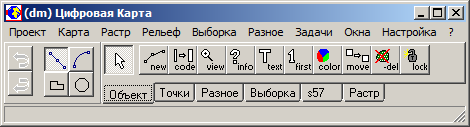
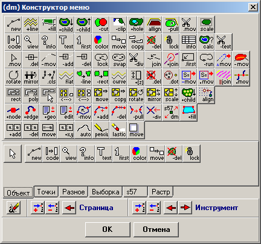
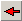
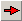

# Управление составом

## Управление программой DMW.exe

Большинство действий по управлению программой и редактированию карт можно выполнить с помощью мыши. Причём левая кнопка мыши используется для выбора команд, режимов, объектов, для начала и продолжения выполнения операций редактирования, а правая – для завершения или отмены операций.

Для выбора любого интерфейсного объекта (команды меню, инструмента, пиктограммы слоя или объекта и др.) нужно навести на него курсор и щёлкнуть левой кнопкой мыши. Везде в данном документе терминами «выбрать» или «указать» обозначаются именно такие действия.

Для выполнения некоторых операций можно воспользоваться также контекстным меню, появляющимся при нажатии правой кнопки мыши в окнах программы.

Некоторые действия выполняются с помощью горячих клавиш на клавиатуре. Информация о горячих клавишах представлена в описании команды функционального меню «Настройка» – «Горячие клавиши…»

## Внешний вид программы и настройка панели инструментов

При запуске картографического редактора (исполняющий файл «dmw.exe» из папки «Bin») появляется главное окно программы, представленное  на рисунке:

Если ранее в редакторе были загружены какие-либо карты и растровые изображения, а так же были открыты дополнительные рабочие окна, такие как «Просмотр» или «Таблица», и выход из программы был осуществлён закрытием главного окна программы или с помощью горячих клавиш Alt+X, то при повторном запуске программа загружает последний рабочий набор данных и окон (Проект).

Все окна картографического редактора имеют интерфейс SDI, следовательно, все окна являются независимыми при размещении их на экране монитора:

")

Многостраничное поле панели инструментов можно настроить по своему вкусу, а также добавить необходимые инструменты, отсутствующие в нём по умолчанию, в диалоге «Конструкторе меню», который вызывается командой функционального меню «Настройка» – «Инструменты…».

Для того чтобы воспользоваться каким-либо инструментом достаточно нажать соответствующую ему кнопку (щёлкнув по ней мышью). После этого программа переходит в режим выполнения функции, для которой предназначен данный инструмент. Например – создание новых объектов, перемещение объектов или отдельных точек объектов, просмотр характеристик объектов и прочее. Кнопка остается «нажатой» до выбора нового инструмента, показывая, какой инструмент сейчас выбран. Инструмент можно выключить, щёлкнув мышью по нажатой кнопке. При выборе некоторых инструментов программа может выводить дополнительные окна и изменять форму курсора в пределах окна редактора.

В одной странице может быть выбран только один инструмент. При переходе к другой странице начинает работать инструмент, выбранный на ней ранее.

Функции некоторых инструментов можно выполнить с помощью контекстного меню, появляющегося при нажатии правой клавиши мыши в окне Редактора.

Команды контекстного меню относятся к активному объекту, т.е. объекту, выбранному в данный момент в окне «Редактор», за исключением команды «Опорные точки».

## Настройка панели инструментов – «Конструктор меню»

Команда «Настройки» – «Инструменты…» открывает диалог «Конструктор меню», предназначеный для редактирования набора инструментов.

В верхней части конструктора представлен весь набор инструментов, используемых в Редакторе, а в нижней части находится конструируемое меню, в котором можно добавлять и удалять инструменты из страниц наборов инструментов, создавать собственные страницы с наборами инструментов, удалять страницы с наборами инструментов, а так же настраивать порядок расположения страниц и инструментов.

### Назначение кнопок управления Конструктором меню

 — «Меню по умолчанию» – восстанавливает меню инструментов по умолчанию

Блок «Страница»

+  — «Добавить страницу» – добавляет новую страницу после выделенной в данный момент страницы в меню, при этом появляется окно, в котором необходимо задать название новой страницы и нажать кнопку «OK», в случае отмены создания новой страницы – нажать кнопку «Отмена»
+  — «Удалить страницу» – удаляет страницу, выделенную в данный момент в меню
+  — «Переместить страницу влево» – перемещает выделенную в меню страницу на одну позицию влево

Блок «Инструмент»

+  — «Добавить инструмент» – добавляет выделенный в верхней части конструктора меню инструмент следующим после выделенного инструмента. Если в меню инструментов нет выделенного инструмента, то добавление указанного инструмента происходит справа от последнего инструмента текущей страницы
+  — «Удалить инструмент» – удаляет инструмент, выделенный в меню инструментов
+  — «Переместить инструмент влево» – перемещает инструмент, выделенный в меню инструментов, на одну позицию влево
+  — «Переместить инструмент вправо» – перемещает инструмент, выделенный в меню инструментов, на одну позицию вправо

Настройки панели инструментов сохраняются при нажатии кнопки «OK» в текстовом файле tools.### в каталоге «work» текущей Рабочей папки программы. При отсутствии в Рабочей папке файла tools.### применяются исходные настройки панели инструментов, используемые по умолчанию.